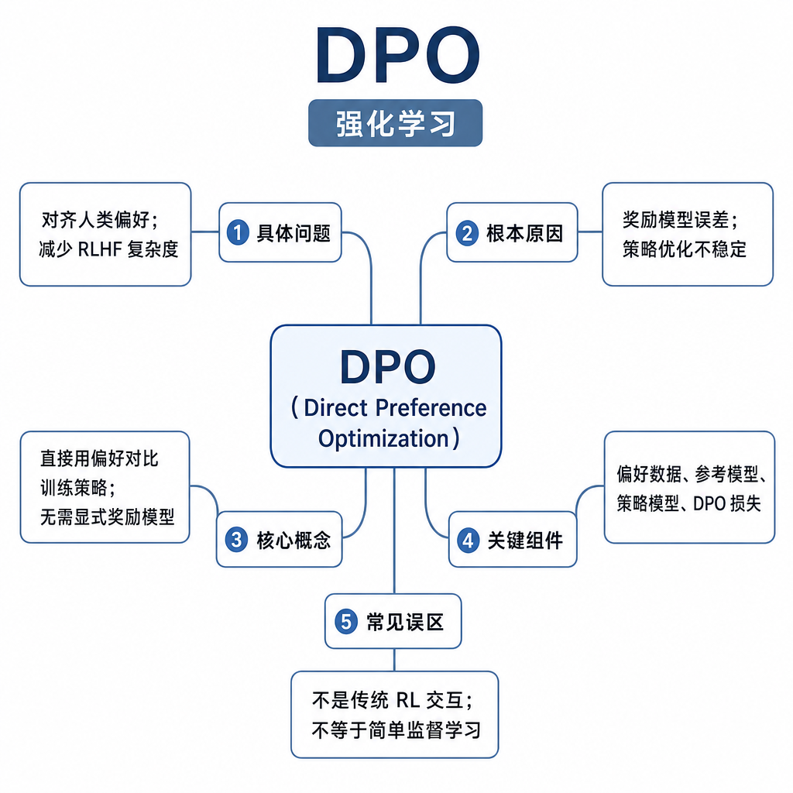
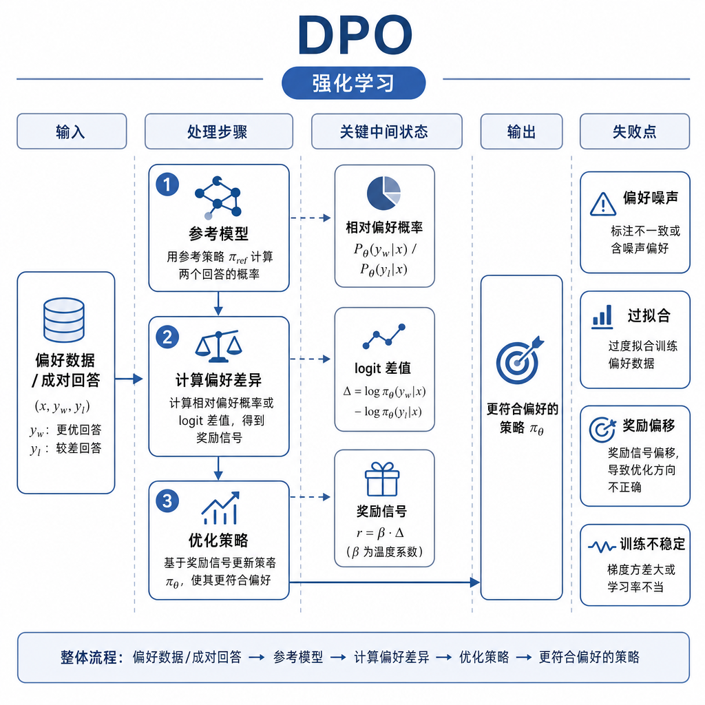
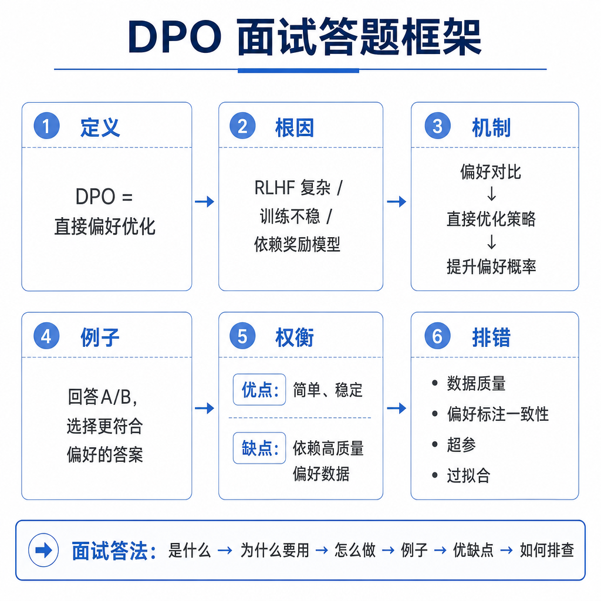

# DPO

面试官问：“DPO 为什么能替代一部分 RLHF？”候选人说：“因为不用奖励模型。”追问马上出现：不用奖励模型是不是就没有奖励信号，chosen/rejected 怎么进入损失，参考模型为什么还要算 log probability，为什么不需要 rollout，beta 控制什么？如果这些问题答不清，就会把 DPO 简化成“便宜版 PPO”。DPO 的重点是把带 KL 约束的偏好优化，改写成直接训练语言模型的离线目标。

## 核心矛盾：偏好数据有了，RL 链路太重

经典 RLHF 要先收集偏好对，再训练奖励模型，然后让策略模型在线采样，用 PPO 更新。这个链路有两个痛点。第一，奖励模型可能被策略模型钻空子。第二，PPO 需要 value model、KL 控制、rollout 采样和大量超参，工程复杂度高。

DPO 问了一个更直接的问题：既然我们已经知道同一个 prompt 下 chosen 比 rejected 好，能不能直接让模型提高 chosen 的相对概率、降低 rejected 的相对概率？答案是可以。DPO 利用一个推导，把“最大化奖励并受 KL 约束”的问题转成偏好对上的监督式损失，因此不需要显式训练 reward model，也不需要让当前策略在线 rollout 后再打分。

## 训练信号、数据格式和目标

一条 DPO 样本包含 `prompt`、`chosen`、`rejected`。训练时分别计算当前模型对 chosen 和 rejected 的 log probability，也计算参考模型对两者的 log probability。目标不是简单让 chosen 概率大于 rejected，而是让当前模型相对参考模型更偏向 chosen。

参考模型通常是 SFT 模型或训练前的策略模型。它提供一个基准分布，防止模型为了拉大 chosen/rejected 差距而偏离太远。beta 参数控制偏好优化强度和 KL 约束强弱。直觉上，beta 越小，模型越激进地追逐偏好差异；beta 越大，更新越保守，更贴近参考模型。

## 为什么 DPO 能绕过 reward model 和 rollout

PPO 需要 reward model，是因为策略采样出新回答后，需要一个标量奖励来指导更新。DPO 使用的是固定离线偏好对，chosen/rejected 已经承载了人类偏好信息。它不需要问“这个新采样回答得多少分”，而是直接问“在这对答案里，模型是否更倾向于人类选择的那个”。

这也是 DPO 的边界。它简化了工程链路，但牺牲了在线探索能力。如果任务奖励来自环境交互，例如代码运行测试、网页操作成功、工具调用完成，DPO 只能学习已有偏好对，不能像在线 RL 那样不断探索新策略。它适合对齐风格、安全和帮助性，不一定适合需要复杂试错的任务。

## 工程例子：客服回复偏好优化

客服机器人有两个回答。chosen 是“确认用户问题，引用政策依据，说明退款入口和人工升级条件”；rejected 是“亲，我们会尽快处理”。SFT 只看 chosen，会模仿好答案，但不知道 rejected 差在哪里。DPO 同时看到好坏对比，可以学习“空泛安抚不如有依据、有步骤的回复”。

偏好对来源可以是人工标注、专家改写、线上 A/B、用户反馈或规则筛选。但数据必须做审计。如果 chosen 普遍比 rejected 长，模型会学会变长；如果 chosen 里混入事实错误，模型会强化错误；如果 rejected 都是明显垃圾，信号太容易，模型学不到细粒度边界。高质量 DPO 数据最好让两边都像真实模型输出，只在关键质量点上有差异。

## 失败模式和排查方式

DPO 的另一个边界是分布外泛化。偏好对通常来自某一批模型、某一套 prompt 和某一类用户。如果线上 prompt 更长、工具结果更多、任务更复杂，模型可能只学到训练集里的表面偏好。工程上常把 DPO 和 SFT、RAG 评测、安全集一起回归，而不是只看离线偏好准确率。

DPO 失败常表现为输出变长、变油、过度拒答、格式僵硬或通用能力下降。排查先看偏好数据分布：长度差、语气差、事实正确性、安全标签、prompt 类型是否平衡。再看 chosen/rejected 差异是否过大或过小。差异过大，模型只学表面；差异过小，训练信号弱且噪声高。

训练侧检查 beta、学习率、batch size、参考模型版本和 log probability mask。只对 answer 部分算概率，避免 prompt 长度污染损失。评测侧要同时看偏好胜率、事实性、安全性、长度、拒答率和格式合规率。面试可答：DPO 直接用 prompt、chosen、rejected 优化模型，让当前模型相对参考模型更偏向 chosen。它不需要 reward model rollout 和 value model，工程成本低；但它依赖离线偏好数据质量，探索能力弱，不适合奖励必须通过环境交互获得的任务。
