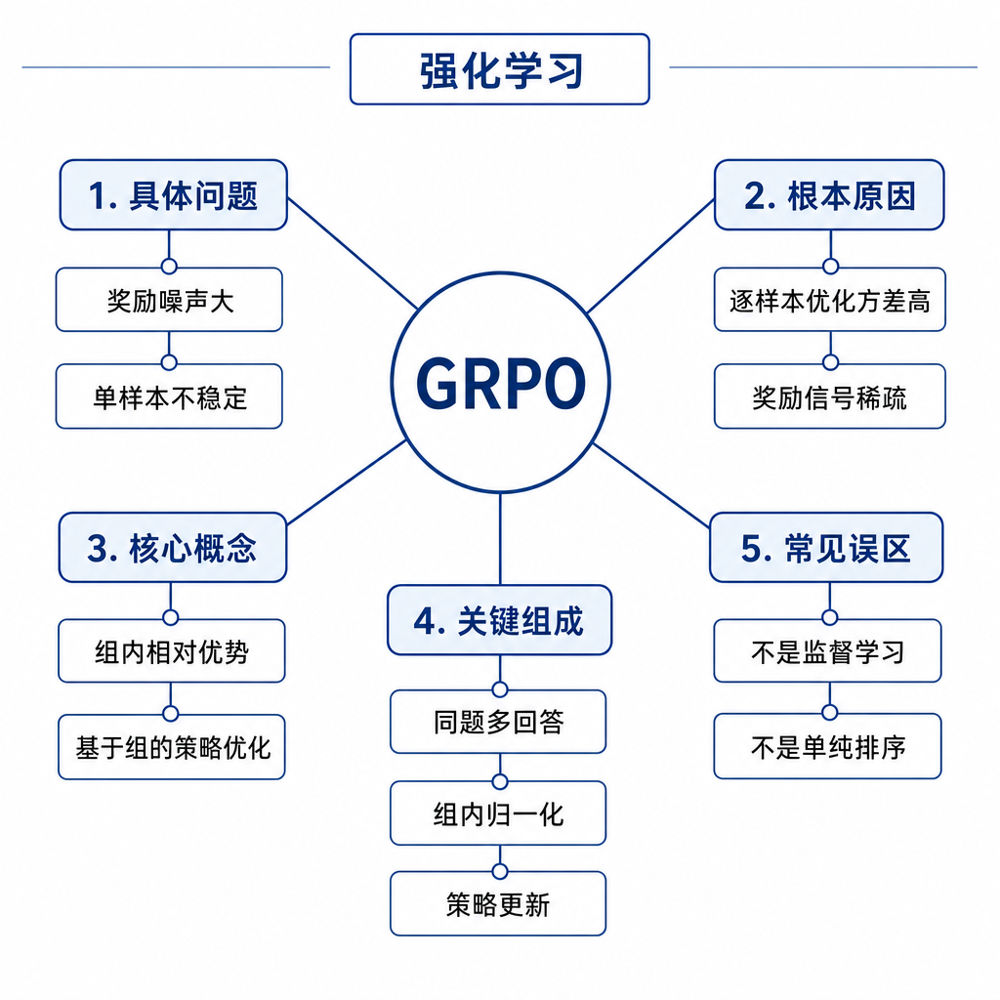
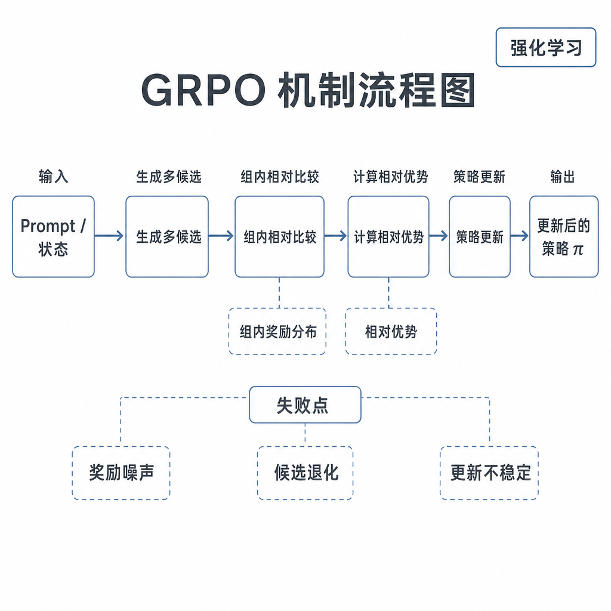
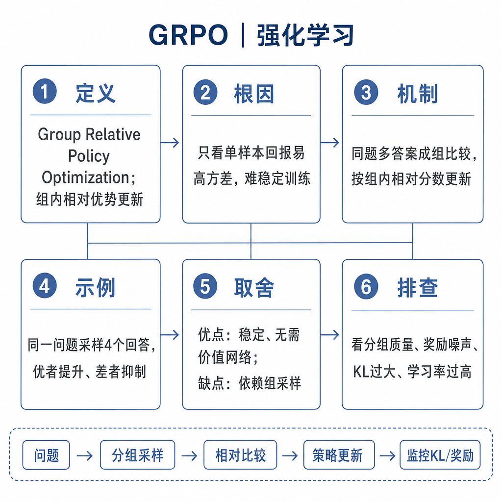

# GRPO

面试官问：“GRPO 和 PPO 最大区别是什么？”候选人说：“GRPO 是 DeepSeek 用的，省显存。”追问来了：省掉的是哪个模型，优势怎么估计，为什么要同一题采样多个答案，组内相对优势有什么用，采样成本会不会更高？如果答不上来，说明只记住了热点。GRPO 的关键是用同一 prompt 下的一组候选回答做相对比较，用组内奖励归一化估计优势，从而减少对独立 value model 的依赖。

## 核心矛盾：PPO 的 value model 很重，可验证任务又有组内信号

PPO 在语言模型 RLHF 中通常需要 value model 估计每个状态的期望回报。对大模型来说，多维护一个价值模型意味着额外显存、训练不稳定和工程复杂度。与此同时，数学、代码、可验证问答有一个特点：同一道题可以采样多个答案，用规则、单元测试、判题器或答案匹配判断好坏。

GRPO 利用这个特点。它不训练单独 value model 做 baseline，而是对同一个 prompt 采样一组 responses，计算每个 response 的奖励，再用组内均值和标准差归一化得到相对优势。一个答案好不好，不只看绝对分数，而看它在同组候选里是否比其他答案更好。这样能省掉 value model，但每个 prompt 要采样多个回答，生成成本会上升。

## 训练信号、数据格式和优化目标

GRPO 的数据单位不是单个 `prompt, response`，而是 `prompt, response_1...response_k, reward_1...reward_k`。奖励可以来自规则函数、测试用例、答案校验、工具执行结果，也可以来自奖励模型。组内归一化后，高于组平均的回答获得正优势，低于组平均的回答获得负优势。

优化目标类似策略梯度：提高正优势回答的概率，降低负优势回答的概率。同时通常保留 KL 约束，避免当前策略偏离参考模型过远。与 PPO 相比，GRPO 的优势估计不依赖 value model，而依赖同组候选的相对表现。组大小、采样温度、奖励尺度和 KL 系数都会影响训练稳定性。

## 为什么省 value model，以及代价是什么

value model 的作用是提供 baseline，告诉策略某个结果比预期好多少。GRPO 用组内均值替代这个 baseline。同一题采样多个答案后，平均奖励就是一个局部参照。通过标准差归一化，还能把不同题目的奖励尺度拉到相近范围，减少难题和易题之间的尺度差异。

代价也很明确。第一，采样成本高。每个 prompt 采样 4、8 或更多回答，生成 token 成本成倍增加。第二，奖励方差影响大。如果一组全错或全对，组内差异很小，学习信号弱。第三，奖励函数必须可靠。错误奖励会稳定强化错误路径，比没有训练更危险。

## 工程例子：代码题强化训练

训练代码模型解算法题时，可以对每道题采样 8 个答案，运行编译和隐藏测试。通过全部测试的答案奖励高，编译失败奖励低，部分通过按通过率给中间奖励。GRPO 在这 8 个答案内部比较，让模型增加通过测试答案的概率，减少错误实现的概率。

这类任务适合 GRPO，因为奖励明确、可自动化、可重复。开放聊天就困难得多。“亲切”“有帮助”很主观，同组比较噪声大。工程上还要避免模型只学最终答案。若奖励只检查最后数值，模型可能跳过推理过程；若测试覆盖不足，模型可能过拟合判题器。更好的奖励会同时考虑格式、过程、执行结果和安全约束。

## 适用边界、失败模式和排查

GRPO 还要求采样策略有足够多样性。同一题的多个候选如果几乎一样，组内比较没有意义；如果全是随机胡写，奖励虽然有差异，却不能形成可迁移的推理路径。实践中会调温度、top-p、组大小和题目难度，让一组样本里既有正确尝试，也有可学习的错误尝试。

GRPO 适合数学推理、代码生成、可验证工具调用、自动判题问答等任务。它不适合奖励高度主观、无法自动验证、样本生成成本过高的场景。对于人工 chosen/rejected 偏好数据，DPO 往往更直接；对于已有成熟奖励模型并需要细粒度在线控制，PPO 仍有价值。

常见失败包括：组内奖励方差太小，模型学不到；采样温度太低，候选答案太相似；温度太高，答案质量太差；KL 太弱，语言质量下降；KL 太强，策略不动；奖励函数被投机利用；题目难度分布不合理，容易题全对、难题全错。

排查时先画奖励分布，观察每组是否有正负样本差异。再看 pass rate、组内标准差、输出长度、KL、重复率和人工抽检。对于代码任务，要检查测试覆盖、编译错误类别和隐藏用例泄漏。面试可答：GRPO 对同一 prompt 采样多个回答，用奖励函数打分并做组内归一化，用相对优势更新策略。它省掉独立 value model，但增加多样本采样成本，适合奖励可自动验证的数学和代码任务。
