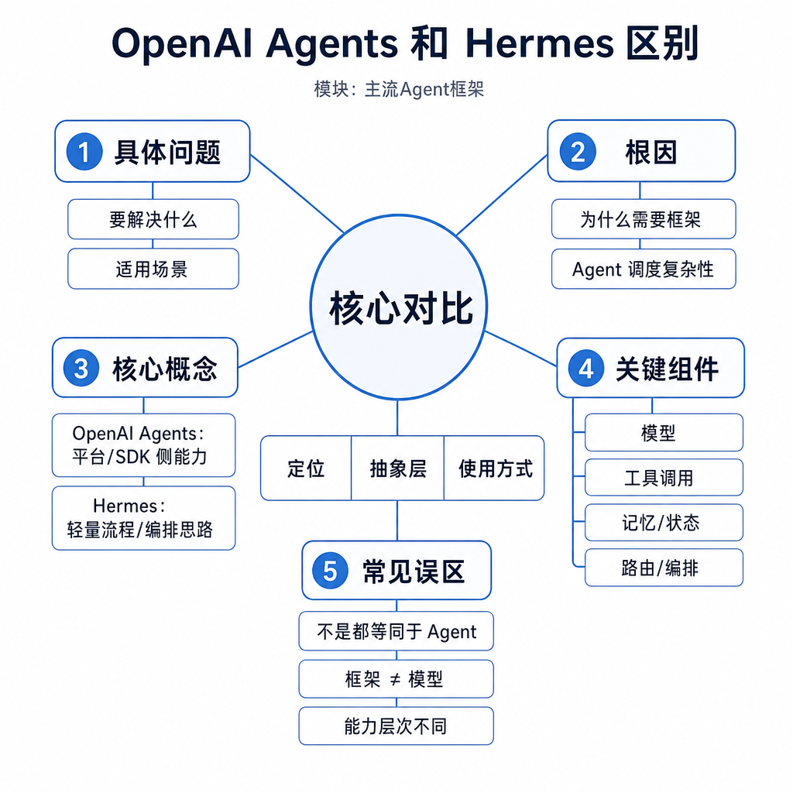
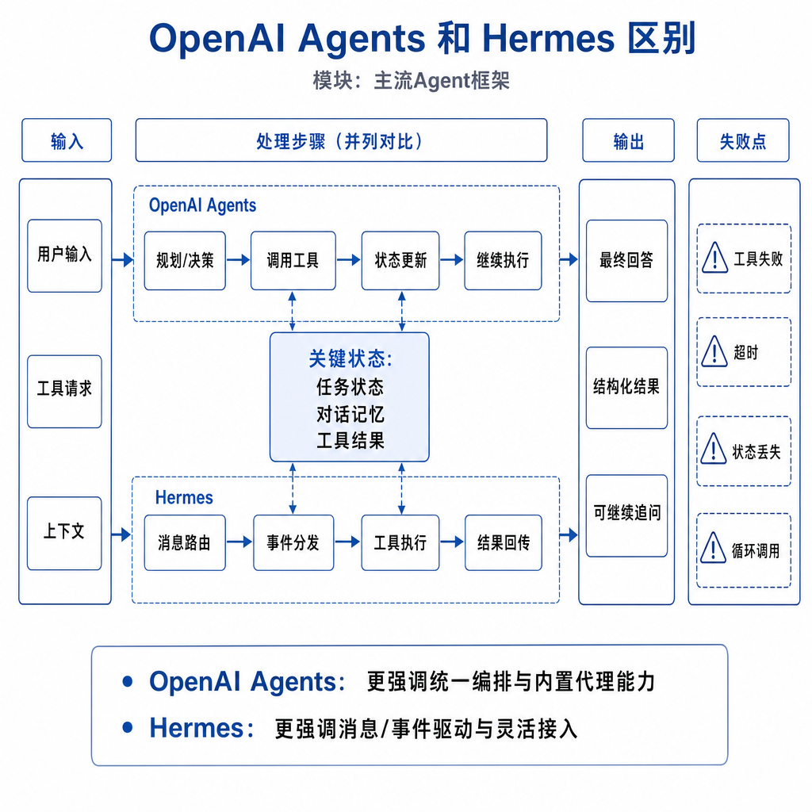
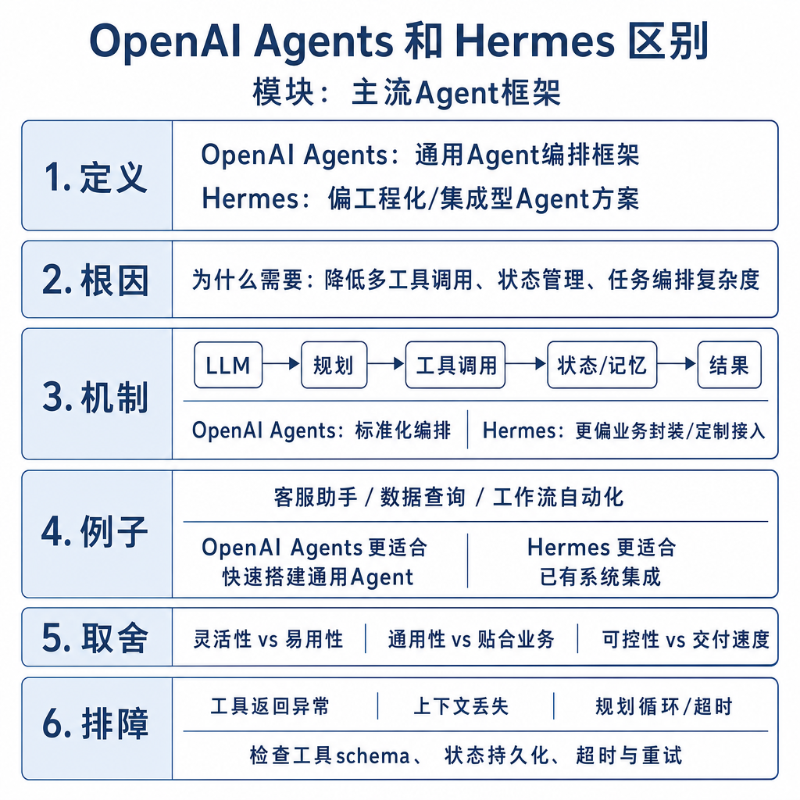

# OpenAI Agents 和 Hermes 区别

面试官问：“OpenAI Agents 和 Hermes 怎么选？”候选人回答：“OpenAI Agents 是闭源，Hermes 是开源。”追问马上来了：它们分别解决 Agent 系统哪一层问题，工具调用格式谁保证，工具真正由谁执行，多 Agent handoff 和 trace 谁管理，私有化部署要补什么安全能力？如果只做模型名词对比，就会忽略 Agent 工程真正的矛盾：模型能提出行动意图，不代表系统能安全、稳定、可审计地执行行动。

## 核心矛盾：模型能力和运行时能力不是一层

一个 Agent 系统至少有四层。第一层是模型，负责理解任务和生成文本或工具调用意图。第二层是工具协议，定义工具名称、参数 schema 和返回格式。第三层是执行运行时，真正调用数据库、文件系统、搜索服务或业务 API。第四层是治理能力，包括权限、状态、日志、重试、评测和安全边界。

OpenAI Agents 更偏托管生态里的 Agent SDK 和运行时抽象，强调 agent、tool、handoff、guardrail、trace 等工程能力。Hermes 更常被讨论为开放模型生态中的工具调用能力，重点是让开源模型稳定输出结构化 function call。前者提供更多端到端框架能力，后者给你模型侧能力和部署自由，但执行层、安全层和观测层通常要自己补。

## 工具调用闭环如何形成

在 OpenAI Agents 类方案中，开发者定义工具 schema，运行时把工具信息提供给模型，模型选择工具并生成参数，SDK 执行工具，把结果写回上下文，必要时继续调用或交给另一个 agent。trace 能记录每一步输入、工具、输出和耗时。guardrail 可以在输入、输出或工具调用前后做拦截。

Hermes 类开放模型更强调模型是否能按模板输出可解析的工具调用。例如你在 prompt 或 chat template 中声明工具列表，模型生成 JSON 或特殊 token 表示调用意图。之后由你写解析器、参数校验、工具执行、异常处理和上下文拼接。模型输出“调用数据库”只是一段文本，系统必须判断参数是否合法、用户是否有权限、调用是否需要审批。

## 工程例子：企业内部工单 Agent

如果企业已经使用 OpenAI 生态，要快速搭一个 IT 工单 Agent：用户描述 VPN 失败，Agent 先查知识库，再调用诊断工具，必要时 handoff 给权限申请 Agent，并把全过程写入 trace。OpenAI Agents 类方案能快速落地，因为工具、handoff、观测和模型能力绑定较紧，原型到生产的样板代码少。

如果企业要求模型完全私有化，日志不能出内网，且已有本地推理集群，那么 Hermes 类开放模型更合适。你可以选择支持工具调用的开源模型，部署在内网，自己接入 CMDB、工单系统和权限中心。但这时工程负担会上升：要设计工具模板、输出解析、重试策略、审计日志、prompt injection 防护和降级方案。

## 适用边界和失败模式

OpenAI Agents 类方案适合快速开发、模型能力强、需要统一 trace、多 Agent 协作和托管生态集成的场景。限制是供应商绑定、成本结构、数据合规和可控性。Hermes 类方案适合私有化、开源模型研究、成本敏感和强定制部署。限制是框架能力弱一些，开发者要承担更多运行时和安全治理工作。

常见失败不是“模型不够聪明”，而是系统边界没设计好。工具描述模糊，模型会乱选工具；参数 schema 太宽，模型会传危险值；handoff 没有终止条件，多 Agent 互相转交；trace 缺失，线上事故无法复盘；权限默认放开，prompt injection 可以诱导模型执行越权动作。

## 排查和面试表达

工具调用不稳定时，先看工具名称、描述和参数是否清楚，再看模型输出是否稳定可解析。OpenAI Agents 类方案重点查 trace、handoff 路径、guardrail 命中和工具错误；Hermes 类方案重点查 chat template、JSON 可解析率、参数校验、解析器容错和模型微调数据。

面试可答：OpenAI Agents 和 Hermes 不只是闭源开源区别。OpenAI Agents 更像托管生态中的 Agent 运行时，提供工具调用、handoff、多 Agent、guardrail 和 trace。Hermes 更偏开放模型工具调用能力，能让本地模型输出结构化调用，但执行、安全、状态和观测要自己实现。选型要看数据合规、部署方式、工具风险、可观测性和团队工程能力。
