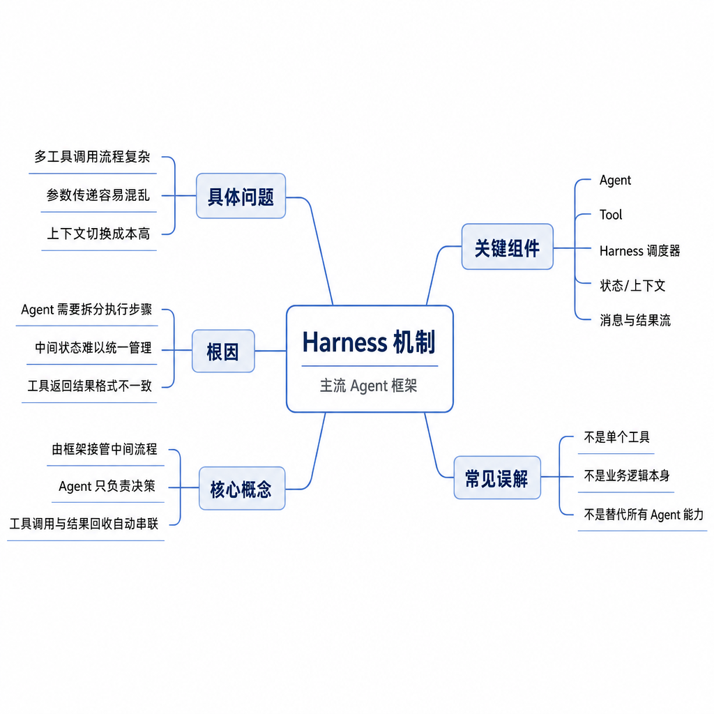
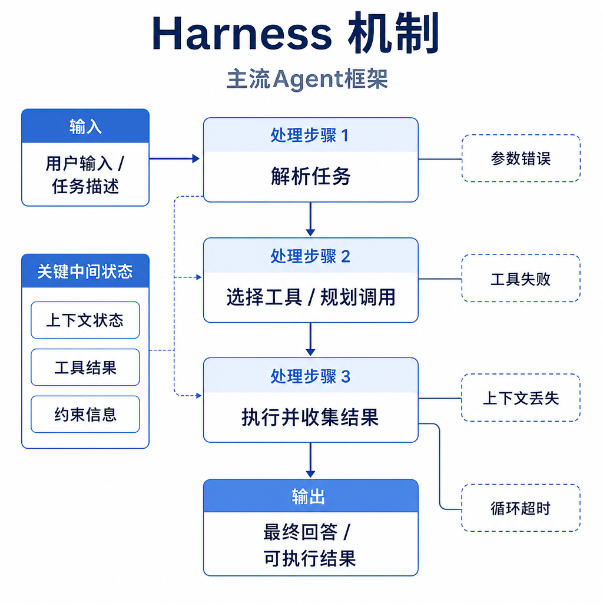
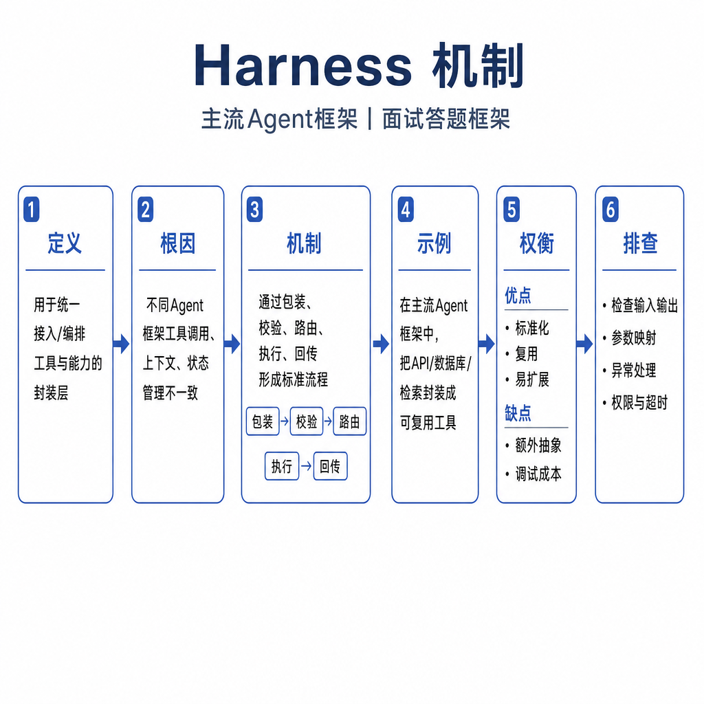

# Harness 机制

面试官问：“Agent 为什么需要 Harness？”候选人回答：“就是给模型接工具。”追问来了：工具调用前怎么校验权限，输出太长怎么回传，命令超时怎么处理，prompt injection 诱导删库怎么办，执行日志怎么审计？如果答不出来，就把 Harness 误解成 prompt 配件。Harness 是模型和外部环境之间的受控执行环境和安全边界，它让模型能做事，也限制模型不能随便做事。

## 核心矛盾：模型只生成意图，真实动作有风险

大模型本质上生成 token。它输出“读取文件”“查询数据库”“发送邮件”，都只是行动意图。真实系统要把意图变成动作，必须回答三个问题：能不能执行，允许不允许执行，执行结果如何反馈。工具适配解决“能不能”，权限和隔离解决“该不该”，观测和状态管理解决“执行后怎么办”。

Harness 的价值是把这些能力放在模型外部，而不是相信模型自觉守规矩。它解析工具请求，校验参数和权限，在受控环境中执行，裁剪或结构化结果，再把观察信息回传给模型。对于代码 Agent、运维 Agent、数据分析 Agent，Harness 往往比提示词更关键，因为风险来自外部动作，不只是回答内容。

## 一次工具调用的执行链路

一次调用通常从模型生成工具请求开始。Harness 先检查工具名是否存在，参数是否符合 schema，路径、URL、账号、命令是否在允许范围。然后权限系统按风险分级处理：只读搜索可以直接执行，写文件可能需要确认，生产数据库和删除命令默认拒绝或走审批。

执行器会在受控环境中运行工具，例如沙箱、容器、临时目录、受限 shell 或只读凭据。执行后收集 stdout、stderr、退出码、结构化返回和耗时。结果不能原样无限塞回上下文，Harness 需要截断日志、突出错误、保留关键上下文，并记录 trace 供审计。这样模型才能形成“观察—行动—再观察”的闭环。

## Harness 不是单纯 prompt，也不是普通函数调用

Prompt 只能告诉模型“不要做危险事”，但不能阻止危险动作发生。普通函数调用只负责把模型输出变成函数参数，也不一定包含权限、隔离、审计和恢复。Harness 是运行时边界：即使模型被诱导、误判或输出非法参数，执行层仍然可以拒绝、确认、降级或回滚。

好的 Harness 会按风险分层。只读文件、搜索、计算属于低风险；写文件、网络请求、发邮件属于中风险；删除数据、修改权限、生产变更、支付和外部发布属于高风险。不同风险对应不同策略：白名单、参数约束、超时、人工确认、最小权限凭据、审计日志和回滚机制。

## 工程例子：代码修复 Agent

用户让 Agent 修复一个单元测试失败。模型先请求搜索测试名，Harness 允许只读搜索并返回结果。模型读取相关文件，提出局部编辑，Harness 检查路径在项目目录内、替换片段唯一、不会覆盖未读文件。随后模型运行目标测试，Harness 设置超时并回传失败栈。模型根据观察继续修改，直到测试通过或达到步数上限。

这个例子里，可靠性来自闭环。没有 Harness，模型只能给出建议补丁；有 Harness，它可以读、改、测、再改。安全性也来自 Harness：它能禁止访问 `.env`，限制 `rm -rf`，阻止向外网发送敏感内容，保留每次编辑记录，并要求高风险命令确认。

## 失败模式和排查方式

适用边界要看工具风险。只读检索、计算器和格式转换可以用轻量 Harness；涉及文件写入、数据库修改、邮件发送、支付、运维命令和生产配置时，就需要更强的隔离、审批和回滚。高风险工具最好拆成小权限动作，不要给模型一个“执行任意 SQL”或“运行任意 shell”的大工具。

Harness 常见失败包括：工具权限过大，模型被 prompt injection 诱导执行危险动作；schema 太松，参数越界；错误信息太粗，模型无法自我修正；结果太长，上下文被日志淹没；状态不持久，中断后无法恢复；重试无限循环，成本失控；trace 缺失，线上事故无法复盘。

排查时先看 trace：模型为什么选择这个工具，参数从哪里来，权限策略是否命中，工具返回是否足够可读。安全问题优先检查默认权限是否最小化，高风险动作是否确认，凭据是否隔离。稳定性问题检查超时、重试、输出裁剪和状态恢复。面试可答：Harness 是 Agent 的受控执行层和安全边界，负责解析行动意图、校验权限、执行工具、回传观察、记录审计，并通过沙箱、确认、超时和回滚降低外部动作风险。
