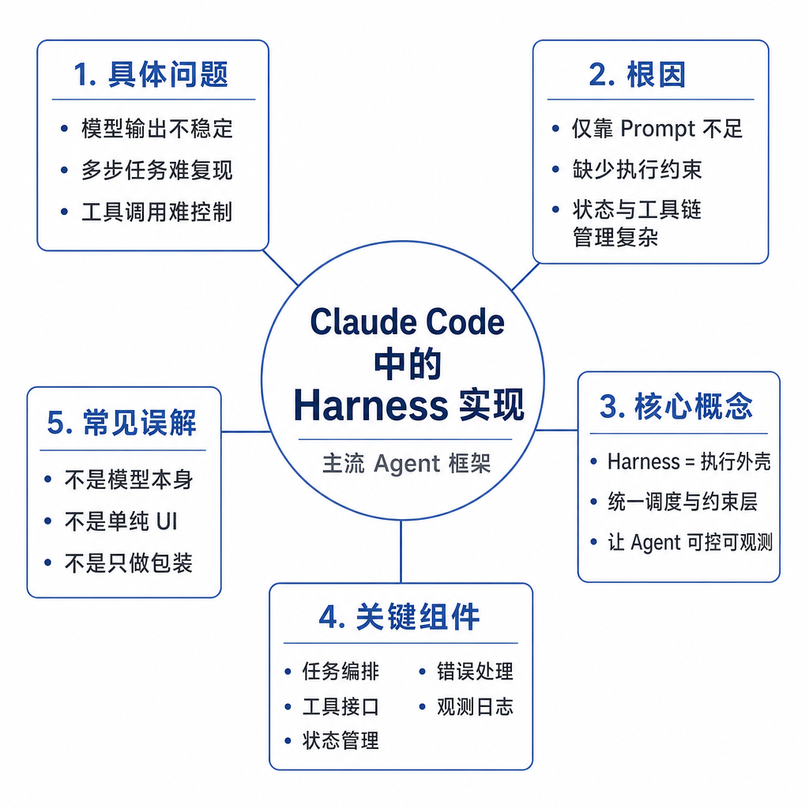
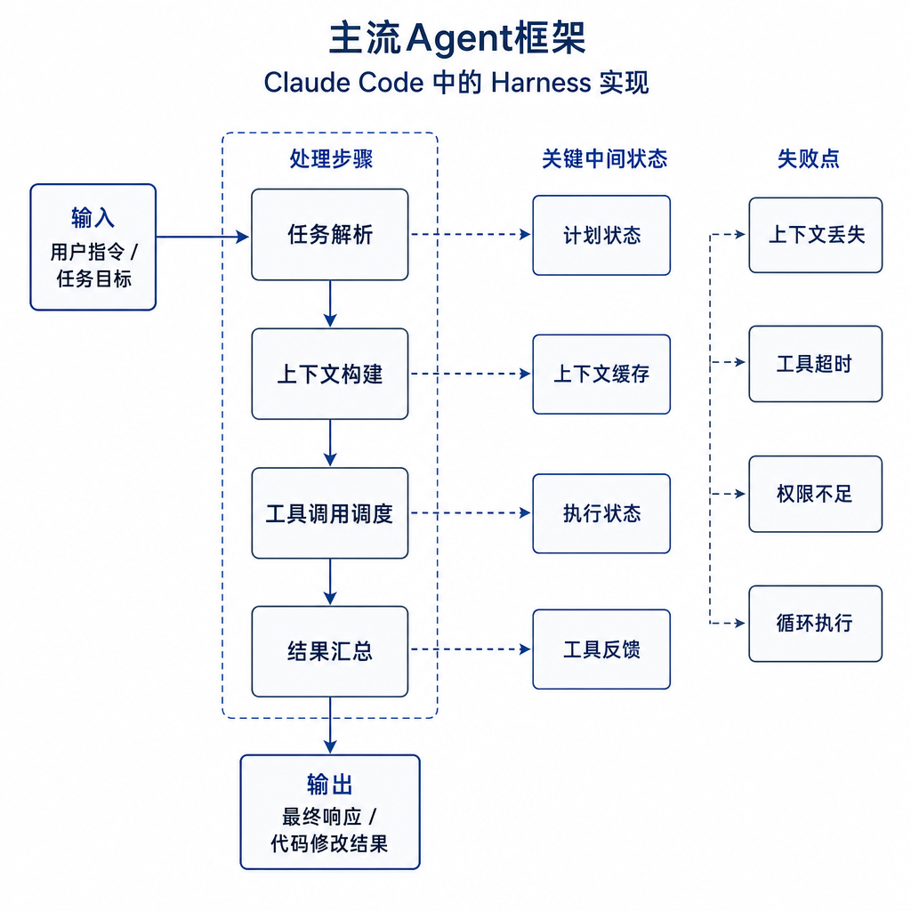
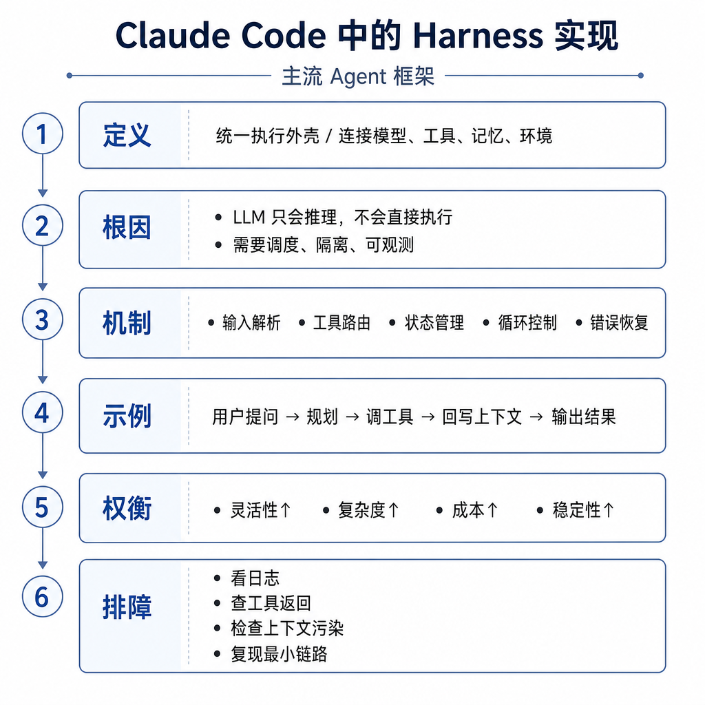

# Claude Code 中的 Harness 实现

面试官问：“Claude Code 为什么能像工程师一样改项目？”候选人说：“因为 Claude 模型强。”追问来了：它怎么知道文件在哪，怎么避免误改，Bash 命令如何受限，测试失败如何反馈给模型，用户本地未提交修改怎么保护，长上下文怎么管理？如果答不上来，就忽略了关键：Claude Code 的能力来自模型和 Harness 的组合。Harness 把模型接入真实代码库，同时提供工具、权限、编辑、测试反馈和上下文管理。

## 核心矛盾：代码任务需要持续感知环境

普通聊天模型可以生成一段补丁建议，但它并不知道项目当前文件结构、依赖版本、测试输出和用户限制。真实代码任务是多步闭环：先定位文件，再理解上下文，然后小步修改，运行测试，根据报错继续迭代，最后报告修改和未验证项。每一步都需要环境观察。

Claude Code 的 Harness 把这些环境能力组织成受控工具。模型不是直接操作磁盘或 shell，而是请求 `Read`、`Edit`、`Bash`、`Grep`、`Glob`、`TodoWrite`、`Skill` 等工具。Harness 校验工具输入，执行动作，返回结构化结果。模型基于结果继续推理，形成“计划—观察—行动—验证”的循环。

## 工具层：搜索、阅读、编辑和命令执行

`Glob` 和 `Grep` 解决定位问题。大型代码库不能靠模型猜路径，必须先按文件名、符号、文本模式搜索。`Read` 提供精确文件内容，避免模型基于过期上下文改代码。`Edit` 要求用唯一旧字符串替换新字符串，比整文件重写更安全，因为它能减少误覆盖和格式漂移。`Write` 更适合新文件或完整重写，但修改已有文件前必须先读。

`Bash` 让模型运行测试、构建、脚本和 Git 命令，但它不是无限权限 shell。Harness 可以限制工作目录、命令类型、超时、后台任务和危险操作。命令输出会回传给模型，模型再决定是否继续修复。这个反馈闭环是 Claude Code 区别于普通代码生成助手的关键。

## 权限和安全边界

Claude Code 的 Harness 把动作按风险分层。读文件和搜索通常风险低；写文件、安装依赖、运行网络命令风险更高；删除文件、强制重置 Git、修改凭据或推送远端属于高风险。高风险动作需要确认、被限制，或要求模型说明原因。这样即使模型误判，也不会直接越过执行边界。

安全还体现在编辑策略和 Git 保护上。精确 `Edit` 能避免大范围覆盖；提交前查看 status、diff 和 log 能防止把秘密文件或无关文件提交进去；禁止随意 reset、clean、force push 能保护用户本地工作。Harness 不是保证模型永远判断正确，而是把错误限制在可发现、可回滚的范围内。

## 上下文管理、任务管理和技能

代码任务很容易跨很多文件，模型上下文有限。Harness 通过工具结果、项目说明、开发者规则、技能和 todo 列表管理上下文。`TodoWrite` 让长任务进度可见，避免做到一半忘记验证。`Skill` 能把特定任务的操作规范注入当前会话，例如写文档、验证应用、创建 PR 或处理 PDF。

上下文管理还包括输出裁剪和步骤分解。测试日志可能很长，Harness 需要返回关键错误而不是淹没上下文。模型必须先搜索再阅读，再编辑，再验证，而不是一次性猜测。好的 Claude Code 使用方式是让 Agent 做可验证的小步修改，并明确报告哪些测试运行了、哪些没有运行。

## 工程例子：修复登录测试失败

用户说“修复登录测试”。Claude Code 会先搜索测试名和登录模块，读取测试和实现文件，理解失败路径。它不会直接重写整个认证模块，而是用局部 `Edit` 修改最小相关代码。随后用 `Bash` 运行目标测试。如果测试失败，Harness 把退出码和错误栈返回给模型，模型继续定位，直到通过或遇到环境阻塞。

如果过程中需要安装依赖、访问网络或执行破坏性命令，Harness 会按权限策略处理。若项目有 CLAUDE.md 或技能说明，模型还会遵守项目约定，例如代码风格、测试命令和提交规范。最终报告应包括修改文件、验证命令、结果和未覆盖风险。

## 失败模式和排查方式

Claude Code 类 Agent 常见失败包括：搜索不充分导致漏改；读取上下文太少导致误解业务；编辑匹配不唯一；测试环境缺依赖；命令超时；日志过长导致模型忽略关键错误；用户未提交修改被覆盖；技能或项目规则过期。Harness 能降低风险，但不能替代评审和 CI。

排查时看完整轨迹：它搜索了什么，读了哪些文件，为什么改这里，是否运行目标测试，失败日志如何反馈。若改动过大，要求小步 `Edit`；若命令失败，检查工作目录、依赖和环境变量；若安全风险高，收紧工具权限和敏感文件访问。面试可答：Claude Code Harness 是代码 Agent 的执行层，提供搜索、阅读、精确编辑、终端、测试反馈、任务列表、技能、权限和上下文管理，让模型能在受控边界内完成真实代码任务。
