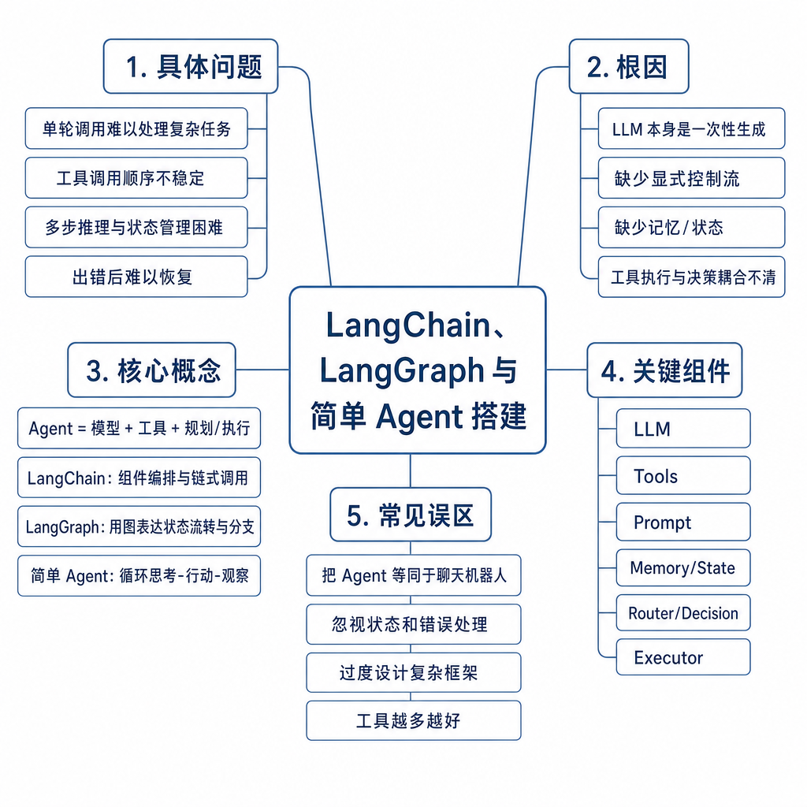
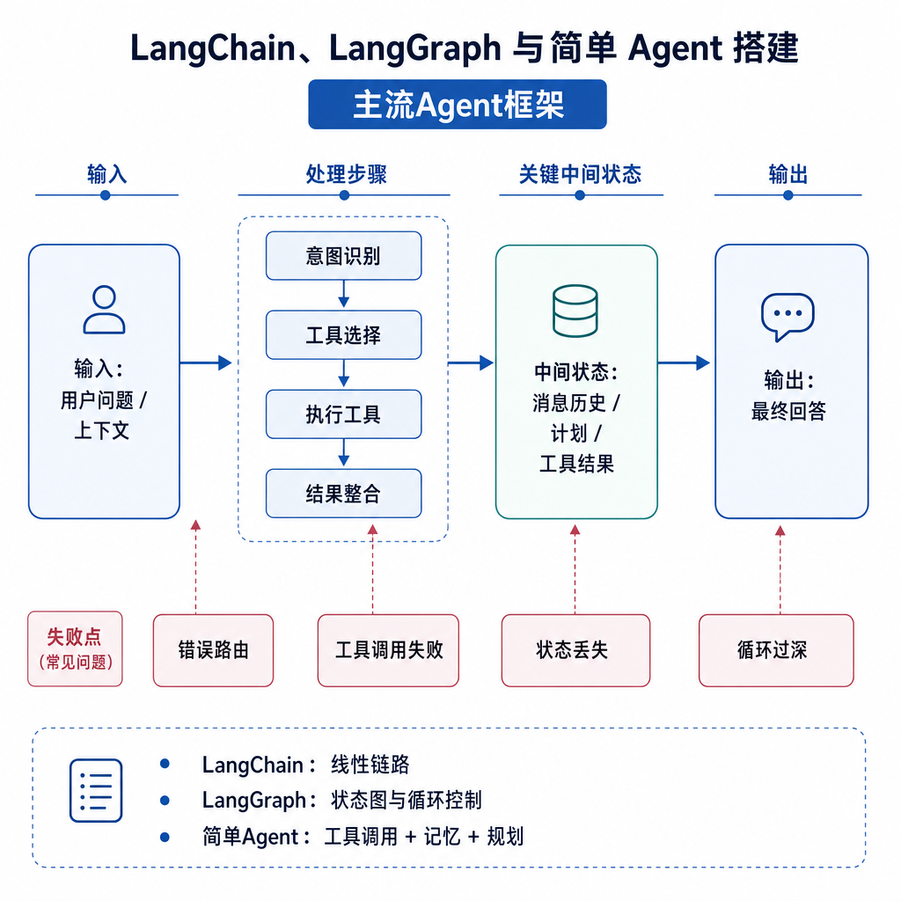
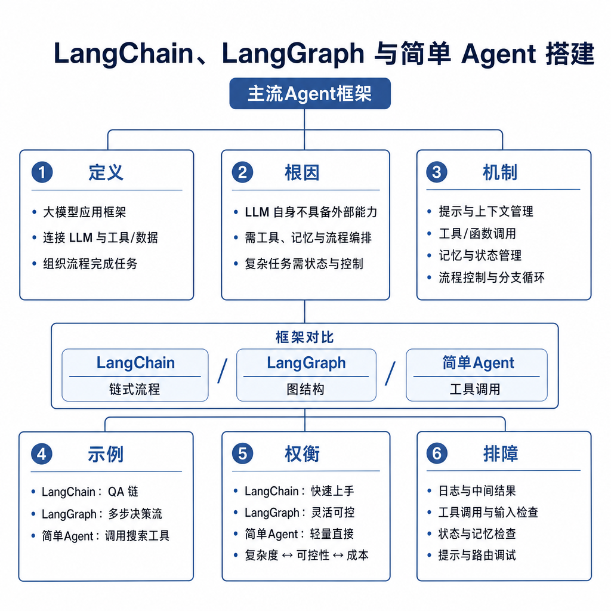

# LangChain、LangGraph 与简单 Agent 搭建

面试官问：“LangChain 和 LangGraph 有什么区别，怎么搭一个简单 Agent？”候选人回答：“LangChain 做 Agent，LangGraph 做复杂流程。”追问来了：框架到底解决什么工程问题，简单工具循环最小闭环是什么，状态放在哪里，失败重试和人工确认怎么做，框架和 Harness 的边界在哪里？如果只背名词，就会把 Agent 做成一团 prompt 和 if/else。

## 核心矛盾：组件拼装和状态控制不是一回事

最简单的 LLM 应用是一次 prompt 输入、一次答案输出。稍复杂的是 RAG：检索文档，再让模型基于证据回答。LangChain 主要解决组件拼装问题，提供模型封装、prompt 模板、retriever、tool、output parser、memory 和 agent executor，让开发者更快把常见 LLM 能力串起来。

Agent 的难点不只是串组件。它要根据工具结果决定下一步，失败后重试，信息不足时追问，高风险动作前等待确认，多轮过程中保留状态。用普通 chain 写复杂流程，会出现隐藏状态和大量分散的 if/else。LangGraph 把流程显式建模为图：节点执行动作，边决定转移，共享状态记录过程，条件边控制分支。

## 简单 Agent 的最小闭环

一个简单 Agent 至少需要四部分：模型、工具列表、决策提示和执行循环。模型读取用户目标和已有观察，决定直接回答还是调用工具；工具执行后返回观察；模型把观察加入上下文，再决定继续调用、换工具、追问用户或结束。这个循环必须有最大步数、工具参数校验、异常处理和日志记录。

LangChain 能快速搭建这个闭环。你定义工具 schema，把工具绑定到 chat model，再用 agent executor 管理“模型选择工具—执行工具—回传观察—继续推理”。它适合原型、标准 RAG、简单工具调用和业务逻辑不复杂的场景。问题是抽象层多，出错时要分清是模型输出、工具实现、parser、retriever 还是 executor 的问题。

## LangGraph 解决什么工程问题

LangGraph 更像有状态流程编排框架。你可以把 `plan`、`retrieve`、`tool_call`、`human_review`、`respond` 写成节点，把用户问题、检索结果、工具输出、错误次数和确认状态放进共享 state。条件边根据 state 决定下一步，例如工具失败且重试次数小于 2 就重试，风险高就进入人工确认，信息足够就生成最终回答。

这种显式图结构的价值在生产环境更明显。流程可以中断和恢复，节点可以单独打日志，人工可以在特定节点介入，失败路径可以测试，状态转移可以审计。复杂 Agent 如果只靠 prompt 让模型“自己决定流程”，可控性会很差；LangGraph 把可控的业务流程从模型隐式推理中拿出来。

## 工程例子：IT 助手从问答到工单

原型阶段，用户问“VPN 怎么配置”，系统检索知识库并回答。用户说“还是连不上”，Agent 调用诊断工具收集系统信息，再总结建议。这个阶段用 LangChain 组合 retriever、LLM 和 tools 就够了，开发速度快。

上线后需求变复杂：不同系统走不同诊断路径；创建工单前必须确认；诊断工具失败只重试一次；超过三轮转人工；高权限命令必须审批；每一步要写入 trace。此时 LangGraph 更合适。状态里保存用户身份、设备类型、已尝试步骤、错误次数、诊断输出和确认状态，流程图明确规定每种情况走哪里。

## 框架和 Harness 的边界

LangChain 和 LangGraph 主要解决编排问题：组件怎么接，流程怎么走，状态怎么传。Harness 解决执行环境和安全边界：工具是否允许执行，凭据怎么隔离，命令如何超时，结果怎么裁剪，高风险动作是否确认，日志如何审计。框架可以调用工具，但不自动让工具安全。

如果工具只是天气查询，轻量权限足够；如果工具能写数据库、发邮件、创建工单、执行 shell，就必须在框架之外设计 Harness。否则 Agent 流程跑通了，生产风险也同时跑通了。好的工程实践是：框架负责编排，Harness 负责执行约束，评测负责验证质量。

## 失败模式、排查和面试表达

Agent 乱调用工具时，先检查工具描述、参数 schema 和 few-shot 示例。流程卡住时，看最大步数、停止条件和状态是否更新。答案不可信时，看检索证据和工具结果是否进入上下文。线上难调试时，加 trace、节点级日志和输入输出快照。高风险动作出问题时，检查 Harness 权限，而不是只改 prompt。

面试可答：LangChain 更偏 LLM 应用组件库，适合快速拼装模型、prompt、retriever、tool 和简单 agent executor。LangGraph 更偏有状态图编排，把复杂 Agent 拆成节点、边和共享状态，适合分支、重试、人工介入和可恢复流程。简单 Agent 的最小闭环是模型决策、工具执行、观察回传和继续判断。生产环境还要补 Harness、权限、审计、评测和回滚。
