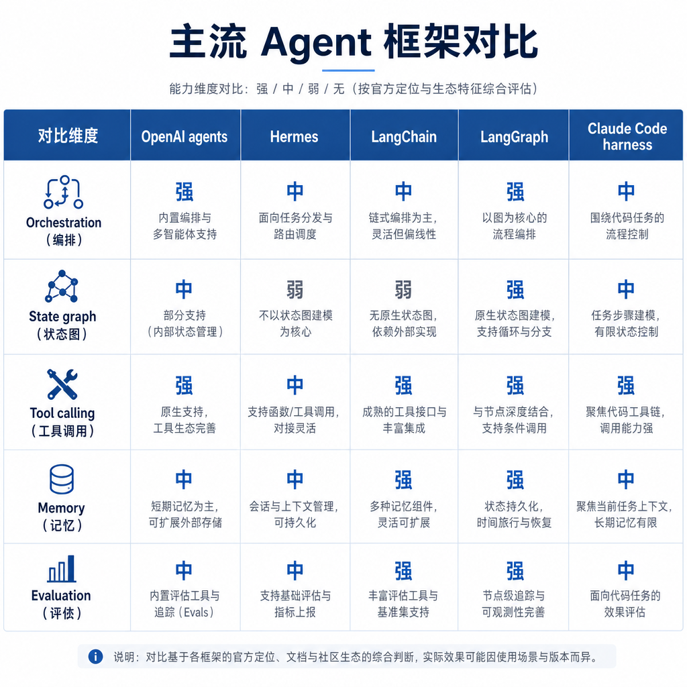

# 主流 Agent 框架

主流 Agent 框架帮助开发者组织模型、工具、状态、记忆、编排和评测。选型时要关注任务复杂度和工程可控性。

## 考点目录

- [OpenAI Agents 和 Hermes 区别](01-OpenAI-Agents和Hermes区别.md)
- [Harness 机制](02-Harness机制.md)
- [Claude Code 中的 Harness 实现](03-Claude-Code中的Harness实现.md)
- [LangChain、LangGraph 与简单 Agent 搭建](04-LangChain-LangGraph与简单Agent搭建.md)

---

[返回总目录](../README.md)
