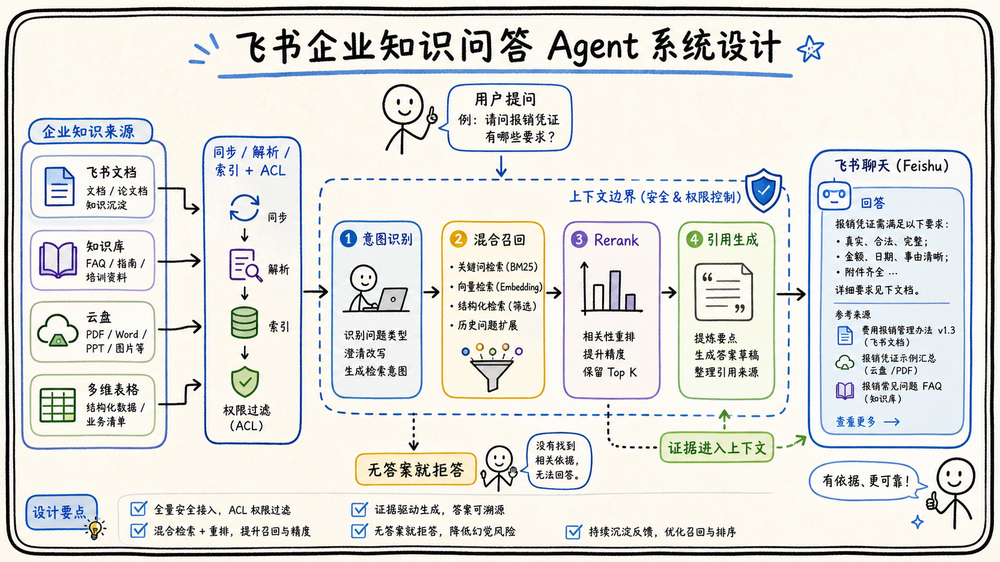

# 06-01 设计一个飞书企业知识问答 Agent

## 面试官追问

**面试官：** 请你设计一个面向企业员工的飞书知识问答 Agent，要求有引用、权限和多轮追问。

**我：** 接入飞书文档，做向量搜索，再让大模型回答。

**面试官：** 权限、更新、无答案、引用和高峰流量怎么处理？

## 常见错误回答

只画“用户—向量库—大模型”三块，忽略连接器、ACL、版本、评测和可观测性。

## 30 秒简答

系统分为接入同步、解析索引、在线问答和治理四层。同步层接入文档、知识库、云盘和表格，保存版本与 ACL；在线层识别意图，做 Query Rewrite、多路召回、权限过滤和 Rerank，再生成带引用的答案；工具层负责实时表格查询和链接校验。

没有足够证据时明确拒答，写操作不在知识问答链路内自动执行。通过 Trace、黄金评测集和灰度发布持续优化，向量库只是可重建索引。



## 原理拆解

### 1. 核心数据流

```text
飞书文档/知识库/云盘/表格
-> 连接器 -> 解析切分 -> 混合索引 + ACL
用户问题 -> 意图识别 -> 多路召回 -> 权限过滤 -> Rerank
-> 上下文组装 -> 带引用生成 -> 引用校验 -> 飞书回复
```

### 2. 关键边界

源系统负责事实和权限，索引负责检索，模型负责表达，运行时负责策略和停止。表格中的实时指标通过受控查询工具获取，不能只依赖旧 Chunk。

### 3. 失败路径

召回为空时请求澄清或拒答；权限不足时不暴露文档存在性；检索超时回退关键词或缓存；引用校验失败时只输出证据摘要。所有失败进入 Trace 和评测集。

## 工程方案与取舍

先做只读、低风险、可引用问答，再逐步增加实时表格分析。租户和 ACL 过滤前置，缓存绑定权限版本，配置和索引版本可回滚。

## 继续追问

**Q：为什么不让 Agent 自动修改知识库？** 知识维护涉及事实责任和版本发布，应通过人工确认或独立 Workflow。

## 面试总结

知识问答 Agent 的核心是“可信证据进入上下文”，而不是模型规模。架构必须同时回答数据接入、检索、权限、引用、更新和失败恢复。

## 深入展开：面试中如何完整回答系统设计

### 1. 先问清需求和边界

我会先确认用户范围、数据源、问答类型、实时性、引用要求、是否允许写操作以及安全等级。制度问答和实时销售分析不是同一个系统：前者可以依赖版本化文档索引，后者需要多维表格实时查询。

### 2. 在线链路的关键状态

一次请求至少携带 `tenant_id`、`user_id`、`query_id`、权限版本和时间。检索结果保存 source_id、chunk_id、版本、分数和过滤原因；上下文组装记录使用了哪些证据；生成结果绑定 citation_id。这样用户追问或投诉时可以重现当时的答案。

### 3. 重要失败路径

如果连接器同步延迟，回答要显示资料更新时间；如果召回为空，系统请求更明确的关键词；如果权限服务不可用，默认拒绝而不是放行；如果模型超时，可以返回检索摘要；如果引用校验失败，降低答案为证据列表；如果用户要求修改知识库，转入人工审核 Workflow。

### 4. 容量和成本估算

可以从日活用户、平均问题数、每次候选数、Embedding 调用量、Rerank 比例和模型 Token 估算容量。检索、Embedding 和模型服务分别设置限流；高峰时缓存公开制度的候选结果，复杂跨文档问题转异步。估算不需要一开始非常精确，但要说明增长后的扩展路径。

### 5. 为什么采用混合架构

固定的身份校验、权限过滤、引用生成和消息发送由 Workflow 或确定性服务负责；模型只处理查询理解、证据选择和自然语言组织。这样既保留 Agent 对自然语言和多步检索的灵活性，又让高风险边界可以审计和回滚。

## 7. 关键接口和数据模型

系统可以把在线请求拆成 Query、Evidence、Answer 和 Feedback 四类对象。Query 保存原问题、用户、租户、意图和权限快照；Evidence 保存来源、版本、Chunk、检索分数和授权结果；Answer 保存引用、拒答原因、模型版本和最终状态；Feedback 用来关联用户是否继续追问、是否转人工以及人工修正内容。这样一次回答既能被展示，也能被评测和回放。

离线同步则维护 Resource、DocumentVersion、Chunk、AclSnapshot 和 SyncJob。Resource 记录源系统 ID 和链接，DocumentVersion 负责版本切换，Chunk 负责检索，AclSnapshot 记录权限摘要，SyncJob 记录游标、失败和重试。在线链路只读取 active 版本，离线链路完成校验后原子切换，避免半成品索引进入生产。

如果面试官要求估算容量，可以先给假设：租户数量、活跃用户、日均问题数、平均候选数和离线更新量，再估算模型调用、检索 QPS、缓存命中和存储增长。估算的价值不是给出一个绝对精确数字，而是证明架构中的队列、限流、缓存和异步边界能够随着规模扩大而演进。

## 8. 设计中的取舍说明

如果资源规模较小，我会先采用托管检索和单一运行时，重点验证权限、引用和失败恢复；数据量、租户数或实时指标需求增长后，再拆分同步队列、索引服务和查询服务。这样既避免过早复杂化，也保留从 Demo 演进到生产的路径。

问答 Agent 的默认策略是只读、带引用、证据不足就拒答。涉及修改知识库、创建任务或发送通知时转成草稿并确认。上线后用真实样本衡量任务解决率、引用正确率、P95、成本和人工接管，逐步决定是否开放更多工具。

## 一分钟示范回答

### 6. 面试时还要补上的生产细节

如果面试官继续追问容量，我会先把问题拆成在线问答和离线同步两类。在线链路需要控制同时请求数、单租户并发数和模型调用轮数；离线链路需要控制文档解析、分块、Embedding 和索引写入的队列长度。热门问题可以缓存“问题标准化结果”和“证据候选”，但最终答案仍要结合用户身份、权限和文档版本重新生成，不能把一个人的答案直接复用给另一个人。

权限失败、索引延迟和模型超时也要分别处理。权限服务不可用时默认拒绝访问；索引还没有同步完成时返回知识库更新时间，并允许用户查看旧版本是否可用；模型超时时可以只返回检索摘要和引用，让用户知道系统已经找到什么，而不是编造一个完整结论。这样回答不仅说明“系统能答”，也说明系统在异常情况下如何保持可信。

最后要强调责任边界：问答 Agent 可以读取授权资料并生成带引用的建议，但不应该自行修改制度、扩大访问范围或替用户执行高风险操作。涉及知识库更新、权限变更和对外发送时，应转为草稿或审批任务。这个设计能让系统在获得 Agent 灵活性的同时，保留企业系统需要的审计、回滚和人工接管能力。

“我会把系统拆成离线同步和在线问答两条链路。离线连接飞书文档、知识库、云盘和表格，做解析、Chunk、Embedding、关键词索引和 ACL；在线先验证租户和用户，再做 Query Rewrite、多路召回、权限过滤和 Rerank，模型只基于授权证据回答，引用由系统生成。没有证据就拒答，实时指标通过工具查询，写操作不在问答链路自动执行。上线用黄金集、Trace、灰度和回滚验证。”
