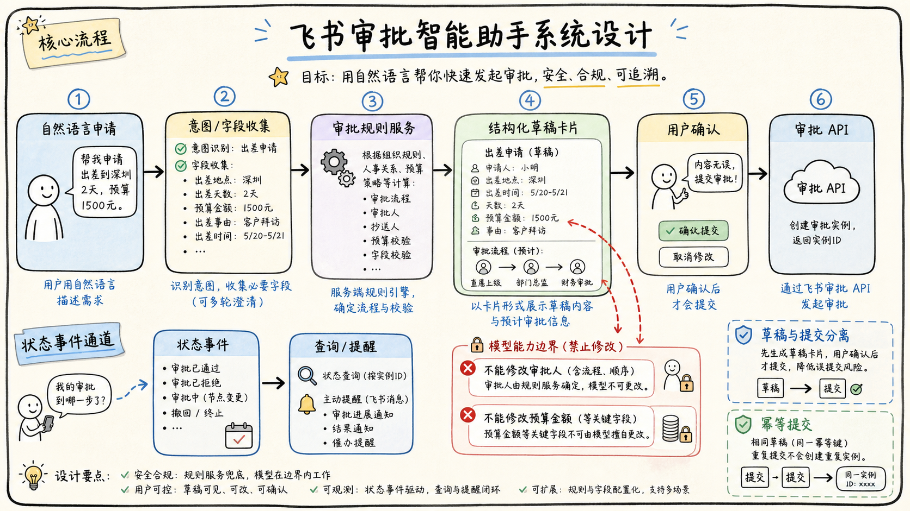

# 06-02 设计一个审批智能助手

## 面试官追问

**面试官：** 设计一个能在飞书里帮助员工发起和跟进审批的 Agent，哪些环节可以交给模型？

**我：** 模型识别用户要申请什么，然后调用审批 API 提交。

**面试官：** 审批人、金额、附件和最终提交谁来决定？模型填错怎么办？

## 常见错误回答

让模型根据历史审批自由推断审批人和金额，直接提交审批实例。

## 30 秒简答

模型适合识别意图、收集缺失字段、解释审批规则和生成草稿，审批类型、字段校验、审批人路由、权限和提交仍由确定性服务控制。提交前展示结构化摘要，用户确认后使用幂等接口发起审批。

系统要能查询状态、提醒待办和解释失败原因，但不能绕过规则改审批人或金额。附件、敏感字段和高金额场景增加人工确认与审计。

## 原理拆解

### 1. 草稿和提交分离

先生成申请草稿，包含类型、字段、附件、审批链和风险提示；用户确认后才调用写接口。草稿可以反复修改，提交是不可逆状态转换。

### 2. 规则服务负责确定性判断

审批模板、必填字段、金额阈值、部门负责人和代理规则由配置或业务服务管理。Agent 可以调用查询工具解释规则，但不能在 Prompt 中复制一套可能过期的审批逻辑。

### 3. 状态查询要以源系统为准

审批实例状态、审批人处理结果和撤回状态通过飞书 API 查询或事件更新，消息提醒只是状态投影。重复事件和重复提交使用幂等键处理。

## 工程方案与取舍

默认只读查询和草稿生成，写入需要确认；高风险审批增加二次认证或人工复核。Trace 记录字段来源、修改人和最终提交参数。

## 继续追问

**Q：模型能自动补齐发票金额吗？** 可以建议，但金额必须来自用户确认或可信附件解析，并由服务端校验。

## 面试总结

审批助手的边界是“模型辅助表达与收集信息，规则服务决定能否提交，用户确认承担最终意图”。

## 深入展开：审批系统设计的状态和风险

### 1. 状态机比聊天记录更可靠

申请可以经历待补充、草稿、待确认、已提交、审批中、通过、拒绝、撤回和异常等状态。聊天消息只是状态变化的展示，不能用“模型说提交成功”作为事实。审批状态由飞书审批实例或业务服务返回，事件用于更新本地状态。

### 2. 字段来源要可解释

每个申请字段都标记来源：用户输入、附件解析、历史建议、规则默认值或模型提取。金额、日期、收款账号和审批人等关键字段不能只来自模型推断，确认卡片要突出显示，并允许用户修改。

### 3. 审批路由是高风险规则

审批人可能由部门、金额、项目、代理关系和组织变更共同决定。Agent 可以解释“为什么是这个审批人”，但路由要由权威规则服务计算；当组织信息过期或规则冲突时暂停提交并转人工。

### 4. 失败补偿和重复提交

用户点击提交后如果网络超时，系统先用幂等键查询是否已经创建实例；如果 API 成功但事件未到，定时对账补齐状态；如果附件上传成功但审批创建失败，记录待清理附件和可重试任务。每一步都要有可见状态。

### 5. 与 Workflow 的组合

Agent 负责理解自然语言、收集字段和生成说明，Workflow 负责字段校验、规则路由、确认和提交。审批完成后事件触发通知和待办更新，避免让模型自行维护一套审批状态。

## 6. 审批助手的接口和状态设计

自然语言入口先生成 Draft，不直接生成 ApprovalInstance。Draft 记录用户原话、抽取字段、字段来源、缺失项和风险提示；用户确认后，Workflow 重新校验字段和路由规则，才调用创建实例接口。接口返回实例 ID 和源系统状态，后续查询、撤回、转交和通知都围绕实例 ID 进行，聊天文本只作为辅助说明。

字段来源可以分为用户明确填写、从附件提取、从组织系统查询和模型推断四类。前三类可以在满足校验条件后使用，模型推断出的金额、审批人或日期必须标成待确认，不能悄悄变成事实。附件提取还要保存文件版本和页码，用户替换附件后重新生成草稿，避免旧数据继续提交。

异常场景要有清晰状态：提交请求超时先查询幂等键，状态未知时显示“正在确认”；源系统已创建但通知失败时补发通知，不重复创建；审批人规则冲突时暂停并转人工；用户撤回后禁止旧卡片再次提交。这样的状态机比“模型回复已完成”可靠得多。

## 7. 设计中的取舍说明

审批助手不能追求“完全自动提交”，而应优先减少填写和查规则的成本。模型适合解析自然语言、补全草稿、解释缺失字段，规则服务负责审批路由、金额限制和权限，源系统负责实例状态。这样即使模型不可用，用户仍能走人工或原生审批流程。

上线时先从低风险、字段稳定的审批类型开始，保留原入口作为回退；收集字段纠错、重复提交、人工转交和审批耗时数据后，再扩大范围。任何自动化写入都要有幂等键、确认和审计，不能因为卡片交互方便就跳过后端校验。

## 8. 面试中如何说明风险取舍

审批助手的收益主要来自减少填写、查规则和状态查询成本，而不是替代审批人。可以先让模型做字段抽取和草稿生成，把确定性规则、审批路由和最终提交交给 Workflow。对于低金额、低风险、字段稳定的类型可以缩短确认流程；对于高金额、敏感数据和跨部门审批，必须保留人工确认和完整审计。

上线后重点观察草稿采纳率、字段纠错率、重复提交率、审批耗时、异常转人工率和错误写入率。发现模型经常误填某字段时，优先改字段来源、提示和校验，不要让模型“更大胆”地猜。这样的指标和取舍能体现你理解审批系统的真实风险。

## 一分钟示范回答

### 6. 审批系统还要回答哪些边界问题

设计审批助手时，我会把一条申请拆成业务单据、审批实例、审批节点、附件和审计事件几个实体。聊天记录只负责承载用户表达，真正的状态必须落在可查询的数据模型里。每一次提交都带幂等键，撤回、转交、加签、拒绝和重新提交都有明确的状态迁移，不能让模型通过改写文字制造一个不存在的“已审批”状态。

还要处理组织结构变化和审批人不可用的情况。审批人离职、部门调整或代理关系变化时，路由服务应根据生效时间重新计算，并把规则版本写入实例。若规则服务返回冲突，系统宁可暂停并提示人工处理，也不能让 Agent 自己选择一个看起来合理的审批人。附件也要绑定到具体实例和版本，避免用户替换附件后历史审批内容被悄悄改变。

在产品体验上，卡片应同时展示字段来源、缺失项、当前状态、下一步责任人和可执行动作。用户点击“提交”后，后台再次校验权限、金额、必填字段和幂等键；执行成功后以源系统状态为准更新卡片。这样可以把“自然语言助手”与“审批事实系统”分开，既方便用户发起申请，也不会把高风险决策交给概率模型。

“我会把审批助手做成草稿优先的系统。模型识别审批类型、提取字段并解释缺失项，规则服务校验必填字段和审批链，用户在卡片中确认结构化草稿后才用幂等接口提交。状态以飞书审批实例为准，事件和定时对账保证最终一致。金额、审批人和附件等高风险字段必须展示来源并支持人工接管。”
