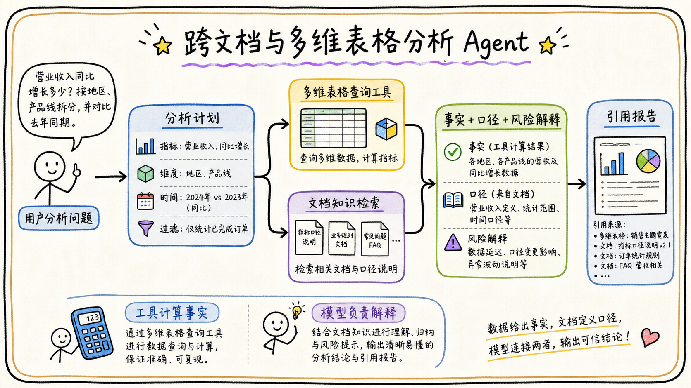

# 06-03 设计一个跨文档/表格的分析 Agent

## 面试官追问

**面试官：** 如何让 Agent 同时分析飞书文档和多维表格，并给出管理层可读的结论？

**我：** 把文档和表格都转成文本，交给大模型总结。

**面试官：** 数字口径、实时性、来源和权限如何保证？

## 常见错误回答

让模型直接从几十个表格 Chunk 中心算指标，不记录查询条件和字段定义。

## 30 秒简答

我会先拆解分析问题，识别指标、维度、时间范围、过滤条件和所需证据。表格数据通过受控查询工具计算结构化指标，文档用于补充口径、背景和风险解释；模型负责规划、解释和组织结果。

每个数字都绑定表名、视图、字段、查询条件、数据时间和权限，结果中区分事实、推断和建议。遇到口径冲突先提示用户确认，不让模型自行选择。

## 原理拆解

### 1. 先做分析计划

计划包括数据源、字段、过滤、聚合、排序、对比周期和输出形式。计划通过 Schema 和权限校验后执行，避免模型生成任意 SQL 或任意字段访问。

### 2. 数字和文本分工

表格工具负责总数、均值、趋势、分组和异常候选；文档检索负责指标定义、项目说明、政策和会议结论。模型只基于工具结果和证据解释原因，不重新计算未经校验的数字。

### 3. 引用要精确到查询

表格引用包含数据源、视图、字段、筛选和时间；文档引用包含标题路径和版本。输出中标注“截至某时间”，避免把实时分析说成永久事实。

## 工程方案与取舍

优先支持有限指标和受控模板，复杂探索请求转人工或生成待确认查询。所有查询记录 Trace，结果缓存绑定数据版本和权限。

## 继续追问

**Q：为什么不让模型直接读整张表？** 成本高、权限难控、数字易错，且无法保证口径和实时性。

## 面试总结

跨源分析的关键是让工具计算事实、文档提供语义、模型负责解释，并用查询计划和引用把三者连接起来。

## 深入展开：分析 Agent 的可控计算链路

### 1. 先把自然语言变成分析计划

计划应明确指标定义、数据源、时间范围、过滤条件、分组维度、排序、缺失值处理和输出格式。比如“本季度延期率”需要先确定分母是全部项目还是已交付项目，不能让模型直接选择一个看似合理的公式。

### 2. 查询工具要限制表达能力

工具可以提供有限的聚合、过滤和排序能力，参数用字段白名单和类型约束验证。复杂 SQL 或任意脚本不直接交给模型执行；如果必须支持探索查询，先在只读沙箱运行，限制扫描量、字段和执行时间。

### 3. 口径冲突要变成待确认项

如果文档说“活跃客户”按最近 30 天计算，而表格视图按最近 90 天计算，系统应列出两种口径和结果差异，询问用户选择。模型可以帮助解释冲突，但不能悄悄合并成一个数字。

### 4. 结果校验和引用

工具返回行数、聚合值、时间范围、数据版本和查询 ID；运行时做数量级、空值、负数、趋势和重复计算检查。最终报告中每个关键数字都链接到表名、视图、字段和过滤条件，文档解释链接到具体章节。

### 5. 大结果集和异步任务

数据量大时先在服务端聚合，不把所有记录放进 Prompt；复杂分析生成 Job，卡片展示进度和取消按钮。用户可以下载明细或查看摘要，但下载同样要经过权限和敏感字段过滤。

## 6. 分析计划的约束和回放

分析计划可以包含指标、维度、时间范围、过滤条件、数据源、聚合方式、排序和输出格式。模型只能从经过审核的指标语义层选择字段，不能任意拼接底层 SQL 或绕过权限。计划生成后先做语法、字段、口径和权限校验，再调用表格查询工具；文档检索只补充背景和解释，不负责替代精确计算。

对跨源任务，要先做数据契约检查：两边的客户 ID、部门名称、日期时区和状态枚举是否能对齐；不能对齐时展示映射规则或要求用户确认。结果保存查询 ID、源版本、行数、快照时间和公式，用户追问某个数字时可以回放同一查询，而不是重新生成一个可能不同的答案。

大数据量任务采用异步 Job，支持进度、取消、重试和过期。取消只阻止后续计算，已经完成的只读结果可以保留；导出文件还要重新做权限和敏感字段过滤。分析 Agent 的核心不是让模型“会算”，而是让自然语言计划、确定性计算、证据引用和人工确认形成完整链路。

## 7. 设计中的取舍说明

分析 Agent 的优先级是口径正确、来源可复核，然后才是表达自然和图表丰富。简单指标可以同步返回，跨表连接、大范围聚合和导出走异步 Job。表格查询工具只允许受控指标和过滤条件，复杂计算由服务端执行，模型不能直接生成任意写入或任意 SQL。

第一版可以只支持少量高频指标和明确的数据源，遇到无法对齐的字段就提示用户确认。通过日志和反馈补充语义映射、错误口径和异常数据样本，再扩大覆盖。这个节奏比一开始宣称“可以分析所有文档和表格”更容易上线和验收。

## 8. 面试中如何说明风险取舍

分析系统首先要保证口径和权限，再追求自然语言体验。第一版可以只支持审核过的指标和少量数据源，遇到无法对齐的客户 ID、时间范围或状态枚举就让用户确认。任何数字都带查询 ID、版本和过滤条件，报告中的结论能回到实际计算。

上线后观察指标成功率、数字校验失败率、引用覆盖、任务耗时、取消率和人工修正率。若模型解释很流畅但数字错误，应优先收紧生成边界，让模型只解释工具已经验证的结果。复杂任务使用异步 Job，避免阻塞聊天入口。

## 面试最后补充

分析结果的可信度来自可复核链路：问题口径、查询计划、字段权限、数据快照、计算结果和引用说明都能被保存和回放。模型只负责解释已验证结果，不能用语言流畅掩盖口径不一致或数据缺失。

## 一分钟示范回答

### 6. 如何把分析结论变成可复核结果

分析 Agent 最容易被忽略的是“口径”。例如“销售额”可能是含税金额、已回款金额或订单金额，“本月”也可能按自然月、财务月或最近三十天计算。因此系统在执行前应把指标名称、过滤条件、时间区间、去重规则和数据版本展示出来，用户确认后才运行复杂查询。模型可以帮助解释口径，但指标定义应来自配置中心或经过审核的语义层。

对文档和表格的结果也要分工：表格工具负责精确计算，文档检索负责解释背景和原因，模型负责把两者组织成结论。每个结论至少保存查询 ID、数据快照时间、来源表、字段、过滤条件和计算公式；如果结果来自多个口径，报告要分栏展示差异，不能为了语言流畅强行合并。

当数据量很大时，系统应把任务转成可取消的异步 Job，先返回分析计划和进度，再生成报告。用户可以追问某一个数字，系统根据查询 ID 回放原始计算；如果源表在任务执行期间发生变化，则标记版本不一致并要求重新运行。面试中能讲清这些细节，才能说明你设计的是可审计的分析系统，而不是把表格内容塞进 Prompt 的聊天 Demo。

“我会先把问题解析成指标、维度、时间和过滤条件，生成结构化分析计划并做字段和权限校验。多维表格工具负责实时计算数字，文档检索提供口径和背景，模型只负责解释经过校验的结果。每个数字携带查询 ID、数据时间和来源，发现口径冲突就让用户选择；复杂任务异步执行并可回放。”
