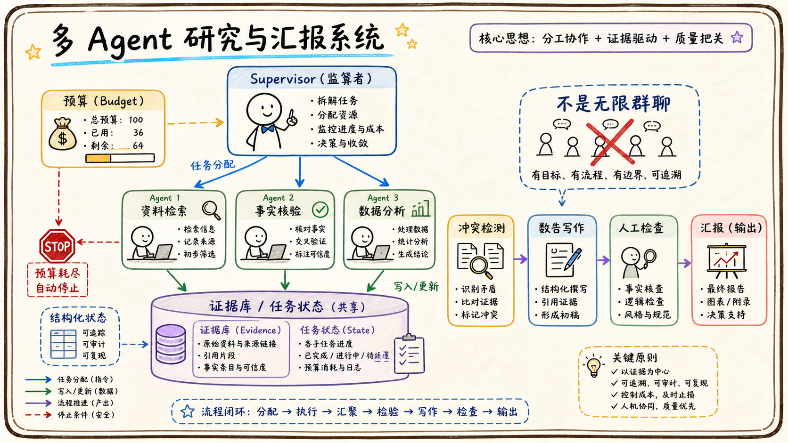

# 06-04 设计一个多 Agent 研究与汇报系统

## 面试官追问

**面试官：** 设计一个能搜集资料、分析竞品并生成汇报的多 Agent 系统，为什么需要多个 Agent？

**我：** 每个 Agent 负责一个任务，最后把结果交给总 Agent。

**面试官：** 如何避免重复搜索、结论冲突和成本失控？谁负责最终事实？

## 常见错误回答

为了体现复杂度随意拆十几个 Agent，让它们自由对话。

## 30 秒简答

我会先用 Supervisor 或 Workflow 定义任务边界，再按职责拆分检索、事实核验、数据分析和写作角色。每个 Worker 有明确输入输出 Schema、工具权限和停止条件，结果进入共享证据库而不是直接互相转发长文本。

Supervisor 负责分派、去重、冲突检测和最终合成，事实核验 Agent 对关键结论要求来源。高成本和高风险步骤设置预算、并发上限和人工检查点，必要时降级为单 Agent 流程。

## 原理拆解

### 1. 用状态图而不是群聊

任务包含研究问题、子任务、证据、结论、置信度和待确认项。Worker 通过结构化状态读写，Supervisor 根据结果决定重试、补充检索或进入写作，而不是让多个 Agent 无限制聊天。

### 2. 角色拆分应有实际收益

当工具、上下文、评测标准或权限明显不同，拆分才有价值。例如外部资料检索和企业内部知识检索可以使用不同数据边界；事实核验需要比写作更严格的引用标准。

### 3. 冲突要显式处理

同一事实出现多个值时，记录来源时间、权威级别和差异，交给核验步骤或人工确认。最终报告区分已证实事实、合理推断和待验证假设。

## 工程方案与取舍

先用单 Agent + Workflow 建立基线，只有任务规模、工具隔离或并行收益明显时才拆多 Agent。每个角色限制 Token、调用次数和可访问资源。

## 继续追问

**Q：多 Agent 一定比单 Agent 好吗？** 不一定，协调成本、延迟和失败面会增加。

## 面试总结

多 Agent 的价值是职责隔离和并行协作，不是让系统显得复杂。Supervisor、共享状态、证据链、预算和人工检查是落地关键。

## 深入展开：多 Agent 系统怎样避免复杂度失控

### 1. 用任务图约束协作

任务图包含研究问题、子任务、依赖关系、输入输出 Schema、完成标准和预算。Supervisor 只有在依赖满足时才启动下一步，Worker 不能私自创建新的高权限子任务。这样可以把“多个模型聊天”变成可观测的有向流程。

### 2. 共享证据库而不是共享长文本

检索 Worker 写入来源、摘要、时间、置信度和原文定位；核验 Worker 读取证据并标记支持、冲突或待验证；写作 Worker 只读取已经通过核验的结论。中间结果通过结构化对象共享，减少上下文膨胀和重复转述。

### 3. 并行、超时和取消

互不依赖的资料检索可以并行，但每个 Worker 有调用次数、Token、时间和工具预算。一个 Worker 超时不一定让整项任务失败，可以标记缺失并让 Supervisor 决定重试、换来源或继续生成带缺口的草稿。用户取消时要停止尚未执行的子任务。

### 4. 最终报告的责任边界

报告生成 Agent 可以组织结构和语言，但关键事实、数字、引用和风险结论来自证据库。冲突没有解决时必须标注不确定性；涉及外部发布或高风险决策时，报告只作为草稿交给人工确认。

### 5. 评估是否值得拆多 Agent

与单 Agent 基线比较并行收益、完成率、引用正确率、成本、延迟和接管率。如果拆分后只是增加 Token 和协调错误，而没有覆盖新的工具或任务范围，就应合并角色，保留更简单的 Workflow。

## 6. 研究任务的证据协议

每个 Worker 不应该只返回一段结论，而应返回结构化 Evidence：来源、定位、摘录、时间、结论、置信度、冲突项和未验证假设。Supervisor 只把满足来源和质量要求的证据交给报告 Agent，报告中的关键判断还要回链到证据 ID。这样可以避免多个 Agent 各自写长文，再让模型凭语言流畅度选择答案。

调度器要有依赖图和预算。资料搜索可以并行，事实核验依赖搜索完成，报告生成依赖核验通过；每个节点有超时、最大重试和取消状态。某个 Worker 失败时可以使用备用来源或把任务标记为证据不足，但不能让其他 Worker 静默填补缺口。跨租户研究时，所有 Worker 继承同一个权限上下文，不能因为并行执行就扩大范围。

最终报告要区分事实、推断、建议和待确认项。对冲突来源给出差异，不把不确定结论写成肯定句；对外发布、财务判断和人员评价设置人工审阅。多 Agent 的价值是分工和交叉验证，不是让系统拥有无限自主权。

## 7. 设计中的取舍说明

多 Agent 只在任务可以清楚拆分、角色拥有不同工具或需要交叉验证时有价值。第一版可以采用一个 Supervisor 加少量检索和核验 Worker，统一证据协议和任务状态，避免角色之间通过长对话互相传递。报告生成和外部发布始终保留人工确认。

评估时与单 Agent 基线比较完成率、引用正确率、冲突发现率、总延迟、成本和人工接管。如果并行只是增加调用次数，却没有减少事实错误或研究时间，就应合并角色。架构的目标是可解释、可控制和可恢复，不是角色数量最大化。

## 一分钟示范回答

### 6. 多 Agent 系统的调度和降级

Supervisor 不应该只负责“把问题转给几个 Agent”，还要维护任务状态、证据状态和预算状态。每个 Worker 接收结构化任务，返回结论、来源、置信度、未解决问题和下一步建议；Supervisor 根据这些字段判断是否继续，而不是把一段自由文本再次发给所有角色。研究任务可以先并行收集资料，再进入统一的事实核验和报告生成阶段，减少角色之间互相覆盖上下文。

并行执行时要设置全局预算，例如最多启动多少个 Worker、每个 Worker 最多调用几次搜索、报告最多允许多少 Token。某一个来源超时，只影响对应分支，其他分支仍可继续；当关键证据缺失时，系统应生成“待补证据”列表，而不是用其他资料猜测。对高风险主题，最终报告必须经过引用检查和人工确认，尤其是涉及外部发布、财务判断或人员评价的内容。

评估多 Agent 是否值得，还要看协作带来的真实增益：是否覆盖了单 Agent 找不到的来源，是否减少了事实错误，是否让人工研究时间下降。如果只是把一个任务拆成多个相似角色，最终延迟和成本都增加，就应该退回单 Agent 或 Workflow。这个取舍体现的是工程判断，而不是角色越多越先进。

“我会用 Supervisor 管理任务图，按检索、核验、分析和写作拆分角色。Worker 使用不同工具和权限，通过共享证据库交换结构化结果，而不是无限聊天。每个节点有预算、超时、重试和停止条件，冲突和关键结论进入人工检查。上线前和单 Agent 基线比较收益，证明拆分确实降低延迟或提高质量。”
