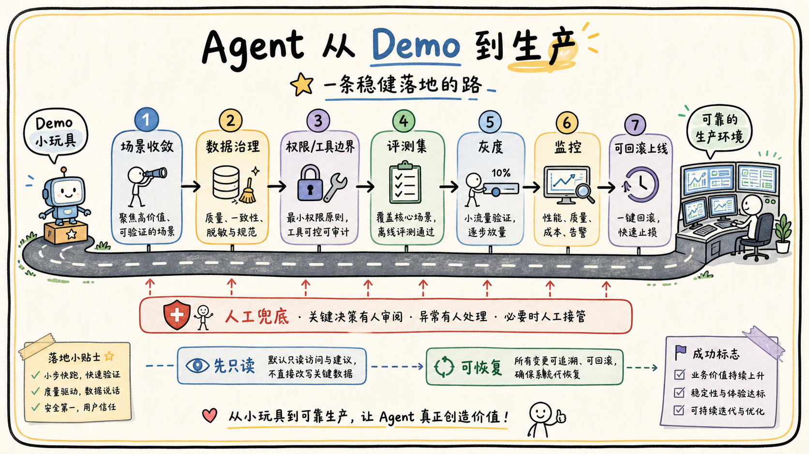

# 06-05 如何从 Demo 做到可上线系统？

## 面试官追问

**面试官：** 一个能回答问题的 Agent Demo，距离生产上线还缺什么？

**我：** 接入真实数据、部署服务、加上登录就可以上线。

**面试官：** 如何验证效果、控制风险、监控成本并支持回滚？

## 常见错误回答

直接把 Demo 的 Prompt 和一个 API Key 放进生产服务，没有评测、权限和恢复方案。

## 30 秒简答

我会按“场景收敛—数据治理—运行时边界—评测—灰度—可观测—回滚”推进。先选低风险、可量化的任务，建立真实评测集和失败分类；再补齐身份、ACL、工具 Schema、确认、幂等、限流和审计。

上线前做离线门禁和安全测试，小流量灰度时同时观察完成率、引用、成本、延迟和接管率。模型、Prompt、索引、工具和策略都版本化，出现回归可以快速回到稳定版本。

## 原理拆解

### 1. 先定义上线边界

明确允许的用户、数据源、工具、动作和失败处理。第一版优先只读问答、摘要和草稿，不把高风险写操作和开放式自主执行放进 MVP。

### 2. 用指标验证价值

建立完成率、引用正确率、拒答正确率、平均轮数、P95 延迟、单任务成本、人工接管和安全拦截指标，并和普通搜索或 Workflow 基线比较。

### 3. 生产能力必须可恢复

任务超时可查询，工具失败可重试或人工接管，事件可重放，索引可重建，配置可回滚，敏感数据可删除。没有这些能力，Demo 的偶然成功不能说明可上线。

## 工程方案与取舍

以一个真实部门做灰度，保留人工兜底和反馈入口；每次只开放一类能力，积累 Trace 和失败样本后再扩大范围。

## 继续追问

**Q：什么时候可以开放写操作？** 当只读任务的权限、评测和监控稳定，并且写操作具备确认、幂等和回滚或补偿机制。

## 面试总结

从 Demo 到生产不是“部署得更稳定”，而是把数据、权限、工具、评测、监控和恢复补成系统闭环。

## 深入展开：从 MVP 到生产的阶段性路线

### 1. 第一阶段只验证核心价值

选择一个低风险、频率高、答案可验证的任务，例如制度问答或会议纪要草稿。明确用户、数据源和成功指标，先做最小链路，不同时解决所有企业自动化问题。第一版必须保留人工反馈和失败样本。

### 2. 第二阶段补齐运行时边界

加入租户和用户身份、ACL、工具白名单、Schema、超时、幂等、审计、限流和状态查询。把 Prompt 中的关键约束迁移到代码和服务端策略，让模型即使输出异常也无法越权或重复写入。

### 3. 第三阶段做评测和灰度

建立黄金集和安全红队集，与普通搜索、人工流程或固定 Workflow 做基线比较。按部门或租户灰度，模型、检索、工具和策略分别可开关；监控完成率、引用、延迟、成本和接管率，出现回归自动回滚。

### 4. 第四阶段补齐恢复能力

任务超时可查询，事件可重放，索引可重建，工具结果可对账，敏感数据可删除，配置和模型可回滚。没有这些能力时，系统可能在 Demo 中成功，但无法解释线上偶发失败。

### 5. 生产责任和产品体验

给用户明确说明 Agent 能做什么、不能做什么；高风险动作展示影响并确认；失败时提供重试、补充信息和人工入口。产品体验不是装饰，它决定用户是否会在错误发生时及时发现并纠正。

## 6. 生产化验收的最小标准

上线前要定义功能、安全、可靠性和运营四类验收。功能上验证主要意图、无答案、长任务和工具失败；安全上验证租户隔离、ACL、注入、敏感输出和高危确认；可靠性上验证超时、重试、幂等、取消、恢复和回滚；运营上验证 Trace、告警、人工接管、反馈和知识源责任人。四类中任何一类没有闭环，都不适合直接放大流量。

还要明确 SLO 和降级策略，例如普通问答的 P95 延迟、引用覆盖、人工接管率和高风险错误上限。达不到时，系统可以退回只读检索、返回证据摘要、延后通知或转人工，但不能为了保持“像成功”而编造答案或执行未知状态的写操作。上线方案应包含值班人、告警渠道、恢复手册和回滚开关。

Demo 到生产不是一次性重写，而是持续缩小不确定性：先固定数据和任务，再补权限和工具边界，再建立评测和观测，最后灰度验证真实用户。每个阶段都留下可回放的版本和指标，下一阶段才有证据可用。

## 7. 设计中的取舍说明

生产化不等于一次把所有能力补齐，而是先确定低风险场景和成功标准。只读问答可以先上线，写操作、批量导出和外部发送继续保持草稿或人工审批。每次发布绑定模型、Prompt、索引、工具和策略版本，出现回退时可以准确定位并恢复。

上线后的工作包括数据责任人、值班和告警、用户反馈、评测集维护、权限变更和删除请求处理。只有这些责任落到团队流程里，系统才不是“开发者电脑上能跑”的 Demo，而是可被组织长期使用和维护的产品。

## 8. 面试中如何说明风险取舍

我会把上线拆成明确阶段：先验证一个低风险场景的价值，再补齐身份、权限、工具边界和失败恢复，随后建立真实评测、Trace 和灰度，最后才考虑扩大租户和开放写操作。每一步都有退出条件和回滚方式，避免 Demo 一成功就直接连接生产数据。

上线后的责任包括数据源所有者、策略维护者、告警值班人和人工接管人。模型、Prompt、检索、工具和权限配置都要有版本，删除请求、数据过期和事故复盘也要有流程。生产化是工程、产品和运营共同完成的交付，不只是换一个部署环境。

## 面试最后补充

上线前还要准备恢复演练：模拟模型超时、索引损坏、权限服务不可用、事件积压和工具返回未知状态，确认系统能降级、告警、暂停高风险动作并由人工接管。没有经过演练的恢复方案，仍然只是文档里的假设。

## 一分钟示范回答

### 6. 上线前的责任清单

从 Demo 走向生产，除了技术指标，还要明确谁负责数据、谁负责模型、谁负责工具和谁负责线上事故。每个知识源需要有所有者、同步周期、删除策略和过期处理人；每个工具需要有权限范围、调用额度、幂等策略和撤销方式；每个模型版本和 Prompt 版本都要能回溯到具体发布记录。没有这些责任信息，出现错误时很难判断是数据问题、检索问题还是生成问题。

上线检查可以按四类进行：功能检查验证正常链路和边界输入，安全检查验证越权、注入和敏感信息泄露，稳定性检查验证超时、重试、限流和恢复，运营检查验证反馈入口、人工接管和告警响应。灰度期间按租户、部门或用户群逐步放量，每次只改变一个主要变量，并保留旧版本回滚开关。

真正上线后还要建立固定复盘节奏。每周抽样查看失败 Trace，按意图识别、检索召回、权限过滤、工具执行和答案表达分类；高频失败进入评测集，修复后先离线回归，再小流量验证。这样系统的迭代依据来自真实问题，而不是只看几个演示案例是否成功。

“我会先收敛一个低风险场景，建立真实评测和基线；再补身份、ACL、工具 Schema、幂等、审计和可观测性；之后做安全门禁和小流量灰度。模型、Prompt、检索、工具和策略都版本化，任务可重试、可取消、可回放，出现质量或安全回归能快速回滚。这样 Demo 才能逐步变成可运营系统。”
