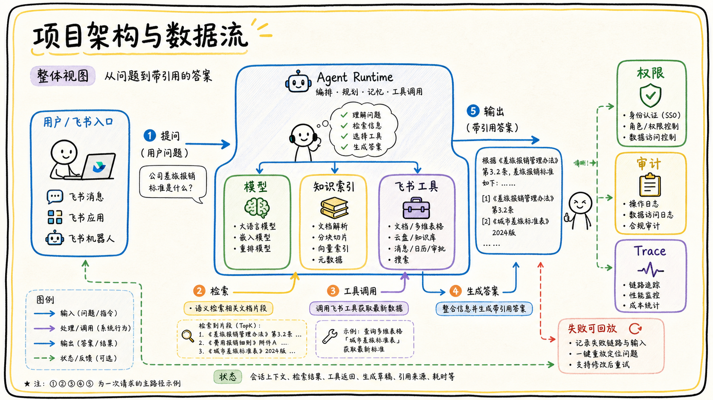

# 07-01 项目架构图与数据流怎么讲？

## 面试官追问

**面试官：** 请你介绍一下这个飞书 Agent 项目的架构和一次请求的数据流。

**我：** 用户提问后，系统调用大模型搜索知识库，再返回答案。

**面试官：** 数据从哪里来？权限在哪一层？模型调用失败或工具超时怎么办？

## 常见错误回答

只讲技术名词，不说明组件之间的输入输出、状态和失败路径。

## 30 秒简答

我会按入口层、编排层、知识层、工具层和治理层讲。入口识别租户和用户，编排层负责意图、状态和 Agent Loop，知识层负责同步、解析、检索和引用，工具层封装飞书 API，治理层提供权限、审计、Trace、限流和评测。

一次问答先经过身份和权限，再做检索与工具调用，模型只看到授权后的证据；最终答案经引用和敏感信息校验后返回。每一步都有 trace_id、超时和失败分支，便于回放。

## 原理拆解

### 1. 架构图要表达边界

图上标清用户、飞书事件或 API、Agent Runtime、模型、检索索引、源系统、工具适配器和观测平台，并说明哪些是同步链路、哪些是异步链路。

### 2. 数据流要能追踪

从用户输入到最终回复，说明身份上下文、Query、候选 Chunk、工具参数、工具结果和引用如何流动。不要只画箭头，要写出关键数据结构和版本。

### 3. 失败路径同样重要

检索为空、权限拒绝、模型超时、API 限流、卡片发送失败和人工接管都应在图中有去向。面试官通常通过失败路径判断你是否真的做过系统。

## 工程方案与取舍

准备一张简化总图和一张关键链路图；总图讲组件，细图讲一次请求。每个模块都能说明为什么存在、谁负责和如何监控。

## 继续追问

**Q：模型是架构中心吗？** 不是，模型是推理组件，权限、数据和运行时边界更决定生产可靠性。

## 面试总结

讲架构要围绕数据流和控制边界，而不是罗列技术栈。能说明输入、输出、状态和失败路径，才算真正讲清项目。

## 深入展开：如何把一张架构图讲成项目故事

### 1. 先讲入口和目标

说明用户是在飞书私聊、群聊、卡片还是网页入口发起请求，入口如何识别租户和用户，以及请求最终要完成的是问答、草稿还是写操作。不要一开始就讲向量库，因为面试官需要先知道系统为什么存在。

### 2. 顺着一条主链路讲

可以选择“用户问制度问题”作为主路径：消息进入网关，生成身份上下文；Agent Runtime 判断意图并发起 Query Rewrite；检索服务按 ACL 召回文档；Rerank 选择证据；模型生成带引用答案；引用服务校验链接；飞书消息适配器发送结果。每一步只说一个关键责任。

### 3. 再讲异步和离线链路

在线问答之外，文档同步、Embedding、索引更新、事件消费、评测和回放都是异步链路。说明它们如何通过队列、任务状态和版本连接起来，以及为什么不会阻塞用户请求。离线链路失败时，在线系统如何使用上一份已验证索引也要讲清楚。

### 4. 用一个失败案例验证架构

例如用户没有搜到最新制度：Trace 显示文档事件已到，但解析任务失败，active 索引仍是旧版本。系统返回旧版本并显示更新时间，后台把任务放入重试队列；修复后新版本经过抽样校验再切换。这个例子能证明架构不是只考虑成功路径。

### 5. 个人贡献和边界

总图可以展示团队系统，但要明确自己负责哪几个模块、做过哪些决策、解决了哪类问题、指标如何变化。面试官追问别人负责的部分时，坦诚说明接口和协作方式，比假装全部实现更可信。

## 6. 用一次请求验证架构是否闭环

可以选择“查制度并创建待办”作为演示请求。入口先验证用户和租户，Runtime 判断前半段是只读检索、后半段是写操作；检索层用 Query Rewrite、混合召回和 ACL 生成证据；答案层只生成带引用的草稿；用户点击确认后，工具层再次校验参数和权限，Workflow 通过幂等接口创建任务并回写状态。这个例子能同时展示模型、检索、工具和人工确认的边界。

再补一条离线数据流：文档事件进入队列，连接器拉取最新版本，解析器生成结构化内容，Chunk 和 ACL 写入新索引，评测抽样通过后切换 active_version。若解析失败，在线仍使用旧版本并显示更新时间；若权限收紧，缓存和引用立即失效。架构图只有把成功、失败和回滚都讲清楚，才真正反映生产系统。

面试官追问个人贡献时，直接落到一个可验证模块：例如设计了资源模型、补了权限过滤、定义了 Trace 字段或建立了回归集。说明背景、决策、实现、指标和协作边界，不要只报技术名词。

## 7. 讲架构时主动说明边界

一张图不可能展示所有实现，重点是说明组件之间的契约：入口传递什么身份，Runtime 如何选择路线，检索层返回什么证据，工具层如何校验，结果如何回写。没有必要把每个缓存和 SDK 都画出来，但要把权限、版本、状态和失败恢复讲清楚。

如果面试官质疑系统复杂，可以回答哪些部分已经固化成 Workflow，哪些部分保留 Agent 动态性，以及为什么。系统越稳定的地方越应该确定性化，模型只处理需要理解自然语言或选择检索路径的部分。这样的回答会把架构和业务风险联系起来。

## 8. 面试中如何把数据流讲完整

讲在线链路时先从用户目标出发，再依次说身份、任务状态、检索或工具选择、证据、最终输出和审计；讲离线链路时说资源发现、解析、切分、索引、ACL、评测和版本切换。最后补一条失败路径，说明旧版本如何保留、任务如何重试、用户如何被告知。

架构图的价值是帮助面试官验证边界。模型负责理解和组织，源系统负责事实，权限服务负责授权，工具服务负责校验和执行，Workflow 负责稳定步骤。每个模块的输入输出清楚，个人贡献也就更容易落到具体位置。

## 一分钟示范回答

### 6. 怎样把架构图讲出自己的贡献

讲完总架构后，可以选一条用户请求从入口走到结果：用户在飞书发起问题，入口完成身份和租户识别，Runtime 判断是检索、分析还是写操作，知识层进行召回和 ACL 过滤，模型生成带引用的草稿，引用服务校验后才返回。随后再补充一条异步链路，例如文档更新如何进入事件队列、解析任务、索引版本和可回滚切换。这样面试官能听到系统的时间顺序，而不是只看到一堆模块名称。

个人贡献必须落到可验证的设计或结果上。可以说明自己负责了哪些接口、定义过哪些状态、修复过哪类线上问题，以及改动前后的指标变化。如果某个模块由同事实现，就讲清自己的输入输出和协作方式，不要把团队成果全部说成个人成果。面试官继续追问时，能从架构图落到一次 Trace、一个失败样本和一个修复提交，可信度会明显提高。

最后要主动说明未解决的问题，例如跨租户数据隔离仍需要更多压测、某些老文档还没有完成结构化解析。承认边界并给出下一步验证计划，比声称系统“全部自动化”更像真实项目经验。

“我把项目分成飞书入口、Agent Runtime、知识层、工具层和治理层。用户请求先经过租户和用户认证，Runtime 根据问题做检索或工具规划；知识层用混合检索和 ACL 生成证据，模型只看授权上下文，最终由引用服务校验后回复。离线侧负责同步、解析、索引和版本切换；Trace 串起在线和异步任务。我的主要贡献是检索、权限和评测，曾通过 Trace 定位旧版本召回问题并补上回归集。”
