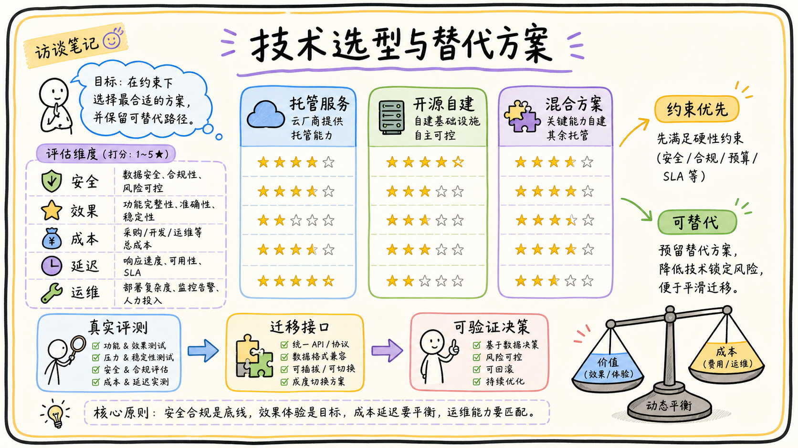

# 07-02 关键技术选型及替代方案怎么回答？

## 面试官追问

**面试官：** 为什么选这个 Embedding、向量库、模型和 Agent 框架？如果不用它们，你会怎么替代？

**我：** 因为它们比较流行、效果好，也方便开发。

**面试官：** 你的约束是什么？替代方案的代价如何比较？

## 常见错误回答

把“大家都在用”当作技术决策，把产品宣传语当作评测结论。

## 30 秒简答

我会先列约束：数据是否出域、中文和领域效果、权限过滤、延迟、成本、团队熟悉度、运维能力和可替换性，再用小规模真实评测做基线。选型记录不仅写最终方案，也写放弃方案、原因和未来迁移路径。

例如向量库可选托管服务、关系库扩展或自建集群；模型可用云服务、私有部署或多模型路由。关键不是选出“最强”，而是在当前风险、成本和交付周期下达到可接受的综合结果。

## 原理拆解

### 1. 用约束而不是偏好决策

把安全、效果、性能、成本、交付和运维列成维度，给出权重和最低门槛。高风险能力的安全门槛不能被低成本抵消。

### 2. 评测数据要接近真实

用真实问题、文档类型、权限边界和高峰流量测试；对模型和检索比较时保持其他变量一致。记录结果和置信区间，避免一次 Demo 决策。

### 3. 设计替代和迁移接口

模型通过统一网关调用，向量索引有可重建流水线，工具通过适配器隔离外部 API。这样更换供应商时不必重写业务流程。

## 工程方案与取舍

先选能快速验证业务价值的方案，同时保留降级、双写或导出能力。对供应商锁定风险较高的组件，提前定义数据格式和替代接口。

## 继续追问

**Q：为什么不一开始就自建？** 自建提高控制力，也提高运维和交付成本，应结合规模、合规和团队能力判断。

## 面试总结

技术选型要能回答约束、指标、替代方案和迁移成本。选型不是表态，而是一个可验证、可回滚的工程决策。

## 深入展开：把技术选型讲出决策证据

### 1. 先写决策记录

每个重要组件都记录背景、候选方案、硬性约束、评测方法、结果、风险和回滚方式。例如向量库选择不仅比较查询速度，还要看 ACL 过滤、增量删除、备份恢复、租户隔离和团队运维能力。

### 2. 区分硬约束和软偏好

数据不能出域、必须支持资源级权限、P95 不能超过某个阈值属于硬约束；开发体验、生态和个人熟悉度属于软偏好。硬约束不满足时直接淘汰，软偏好可以通过培训、适配器或预算解决。

### 3. 做小规模但真实的 POC

POC 不只是让 Demo 跑通，而是用真实文档、真实问题、权限样本和故障注入验证关键路径。模型比较要固定检索和 Prompt，向量库比较要固定 Chunk 和查询量，避免不同实验混在一起。

### 4. 评估替代成本

替代方案包括迁移数据、重建索引、改 SDK、重做监控、重新评测和重新申请权限。通过统一模型网关、索引导出格式和工具适配层，把替代成本前置设计，而不是供应商变化后才开始补救。

### 5. 面对面试官质疑

如果面试官说另一方案更便宜，可以承认它的优势，再说明当前选择解决了什么约束，以及在规模变化后什么时候会重新评估。好的回答不是证明自己的选择永远正确，而是说明选择在什么条件下成立。

## 6. 选型回答中的量化表达

模型可以比较中文领域效果、长上下文、结构化输出稳定性、价格、配额和数据合规；检索可以比较 Recall@K、引用覆盖、权限过滤、延迟、索引运维和重建能力；工具框架可以比较协议复用、调试、重试、取消、审计和供应商锁定。每个维度先设最低标准，再解释为什么当前方案满足最重要的约束。

POC 不能只用三个容易问题，要覆盖缩写、跨文档、无答案、权限不同、旧版本、长任务和高风险写操作。固定数据集、Prompt、模型参数和超时后，记录完成率、事实正确率、引用正确率、P95、成本和人工接管。替代方案如果只在普通问答上更好，但在权限或可靠性上不达标，就不适合直接替换。

为了降低迁移成本，模型通过统一网关接入，Embedding 通过适配器，向量索引保留可导出格式，工具通过稳定协议暴露。迁移还要重新评测、回放历史 Trace、申请权限和灰度验证。真正成熟的选型不是预测未来永远不变，而是给变化留下可控路径。

## 7. 讲选型时主动说明边界

技术选择没有脱离场景的绝对答案。可以说明当前方案适合什么规模、数据类型和团队能力，什么时候会触发重新评估。例如并发、延迟、合规、中文领域效果或供应商配额变化，都可能使原来的模型、向量库或工具框架需要替换。

同时说明没有选择的方案解决了什么问题、为什么当前暂不采用，以及未来如何迁移。面试官听到的是决策过程和风险意识，而不是背诵某个热门组件。任何替代方案都要回到真实评测和运维成本上。

## 8. 面试中如何说明选择不是拍脑袋

先说明业务约束，再说明候选方案和评测方法，最后说明当前选择、放弃原因和替代路径。模型、向量库、工具框架和自建服务都用同一组真实问题比较，并把中文效果、权限、延迟、成本、运维和迁移放在一起看。

如果数据或规模变化，提前定义重新评估的触发条件。例如 P95 超过目标、供应商配额不足、索引重建时间过长、合规边界变化或引用正确率持续下降。能说明什么时候改变选择，说明你关注长期交付而非短期 Demo。

## 一分钟示范回答

### 7. 选型结论要能落到业务约束

最终不要只说“我们选了某个方案”，而要说明它如何满足中文效果、权限隔离、交付周期和成本上限。若未来流量或数据范围变化，哪些指标会触发重新选型，也要提前写清楚。这样技术选型才是一份可复盘的决策，而不是个人偏好。

### 6. 选型回答中的量化表达

面试中可以用一个小表格把选择说清楚：模型看中文和长上下文质量、工具调用稳定性、价格和配额；检索看召回、引用覆盖、延迟、运维成本和权限过滤能力；工具框架看协议成熟度、调试能力、重试和取消支持。每个维度都给出最小可接受标准，再说明最终方案在哪些维度占优、在哪些维度做了妥协。

POC 不应只测一个漂亮问题，而要覆盖真实长尾：同义词、缩写、跨文档问题、权限不同的用户、无答案问题、旧版本问题和高风险写操作。比较时固定数据集、Prompt、模型温度和超时配置，记录完成率、引用正确率、P95 延迟、Token 成本和人工接管率。这样替代方案失败时也能说明失败发生在哪个约束上。

如果未来更换供应商，最好保留统一模型网关、Embedding 适配器、向量索引导出格式和工具协议。迁移不只是换一个 API，还包括重新评测、重新申请权限、回放历史 Trace 和观察灰度结果。把这些成本提前纳入选型，才能避免短期便宜、长期锁定的决策。

“我们的选型先从数据合规、中文领域效果、ACL 过滤、延迟、成本和运维约束出发，再用真实问题做 POC。模型通过统一网关，索引通过可重建流水线，工具通过适配器隔离，所以未来可以替换供应商。放弃方案不是因为它不好，而是当时在权限或交付周期上不满足硬约束；如果规模和合规条件变化，我会重新评测。”
