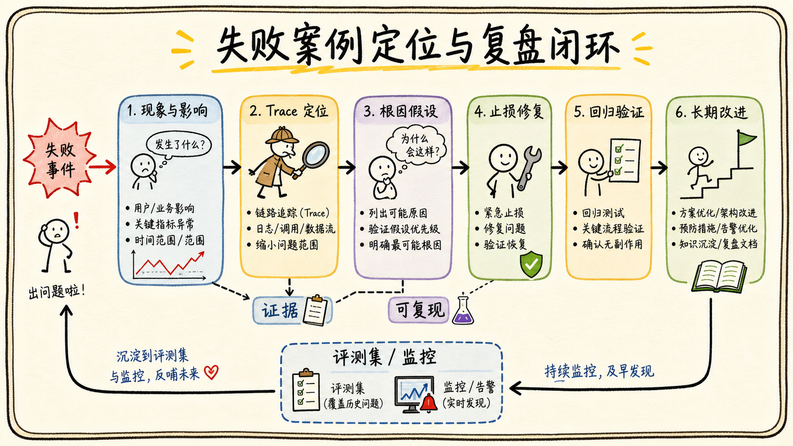

# 07-03 最难的问题、失败案例与复盘怎么讲？

## 面试官追问

**面试官：** 项目中最难的问题是什么？有没有失败案例？你从中学到了什么？

**我：** 最难的是调 Prompt，后来多试了几版就解决了。

**面试官：** 你如何证明问题原因是 Prompt？修复后有没有副作用？

## 常见错误回答

把失败说成“模型偶尔不稳定”，没有数据、定位过程和改进措施。

## 30 秒简答

我会用“现象—影响—定位—方案—验证—复盘”讲失败。先说明用户和业务影响，再用 Trace 拆分检索、权限、工具和生成环节，找到可复现样本；修复后用回归集和线上指标验证，最后记录哪些假设被证伪、哪些边界需要产品化。

好的复盘不回避问题，也不把责任归给模型。它要体现我能把偶发问题变成测试、监控、策略或流程改进。

## 原理拆解

### 1. 先量化影响

说明失败影响了多少请求、哪些用户、是否涉及数据泄露或错误写入，以及临时止损措施。安全事故和普通质量问题的处理优先级不同。

### 2. 用证据定位根因

对比成功和失败 Trace，检查 Query、候选、版本、ACL、工具参数、模型版本和最终引用。把“可能原因”逐个做实验，不要直接改 Prompt。

### 3. 修复要防回归

修复可能提高召回却增加噪声，增加拒答却损失完成率。用分层评测、灰度和回滚验证副作用，并把失败样本加入黄金集。

## 工程方案与取舍

先止损，再修复，再复盘。对于高风险问题优先关闭写工具或收紧权限，之后补充门禁、告警、测试和责任边界。

## 继续追问

**Q：如果根因仍不确定怎么办？** 先记录证据和不确定性，增加观测或保护性策略，不用猜测替代结论。

## 面试总结

失败案例是展示工程能力的机会。重点是证据、影响、可复现性、止损和长期改进，而不是讲一个“最后调好了”的故事。

## 深入展开：一套完整的事故复盘结构

### 1. 用事实描述影响

先说发生时间、影响范围、用户看到的现象、业务损失和安全等级。例如“有 8% 的制度问题引用了旧版本”比“效果变差了”更可验证；如果涉及越权或错误写入，要明确是否有数据外泄和补救动作。

### 2. 建立时间线

列出发布、事件同步、索引切换、异常出现、告警、人工发现、止损和恢复时间。时间线能区分问题是新版本引入、历史数据积累还是外部依赖变化，也方便找到监控为什么没有提前发现。

### 3. 区分直接原因和系统性原因

直接原因可能是过滤条件漏掉版本字段，但系统性原因可能是评测集没有旧版本样本、发布没有灰度、指标只看回答率、回滚没有索引快照。复盘要修复系统性原因，不能只改一行代码。

### 4. 设计验证实验

把失败 Query 固定下来，分别关闭改写、切换检索器、固定索引版本、绕过 Rerank，观察哪一步改变结果。每次只改一个变量，并保留实验记录。这样才能把“我觉得是 Prompt”变成证据。

### 5. 将结论变成动作

动作可以包括补充过滤、增加告警、加入黄金样本、调整权限、增加人工确认、改进回滚脚本和更新应急手册。每个动作有负责人、完成时间和验证指标，避免复盘报告停留在文字层面。

## 6. 复盘如何形成工程改进

一次线上问题要先写清影响范围：多少请求失败、哪些租户受影响、是否出现错误引用或越权、用户是否执行了错误动作。然后按照时间线关联发布记录、Trace、索引版本、事件延迟和告警，区分直接原因与系统性原因。比如“旧版本被召回”可能是表面现象，真正根因可能是父子 Chunk 版本没有继承或删除缓存没有失效。

修复动作分为恢复和预防。恢复可以切换旧索引、暂停高风险写入、重放失败事件；预防可以增加版本门禁、权限变更样本、删除回归、失败告警和灰度停止条件。每个动作都有负责人、完成时间和验证指标，修复后用原始失败 Trace 加回归样本重新验证，而不是只看一次成功请求。

回答面试问题时，既要讲自己做了什么，也要讲没有做什么。例如某个底层 SDK 由同事维护，就说明自己的接口和协作边界；某项指标没有完整采集，就说明后来如何补齐。真实的限制和可验证的改进，比“系统完全没有问题”更能体现复盘能力。

## 7. 讲复盘时主动说明如何防止再发生

修复一个样本不等于修复一类问题。要把样本抽象成失败类别，补充同义表达、不同权限、不同版本和边界数据，再通过回归集验证。修复动作最好同时包含代码或配置改动、监控告警、发布门禁和应急手册，形成多层防线。

复盘也要说明业务沟通：何时通知受影响用户，是否需要撤回错误结果，谁批准回滚，如何确认恢复。技术问题一旦影响企业用户，沟通和责任同样属于系统可靠性的一部分。

## 8. 面试中如何说明复盘有结果

用“现象、影响、根因、恢复、预防、验证”六步回答，并给出每一步的证据。恢复可以切换版本或暂停风险动作，预防要进入代码、配置、监控、评测集和应急手册，验证要看同类错误是否下降而不是单个请求是否成功。

还要说明业务沟通和个人边界：谁决定回滚，是否通知用户，哪部分由自己负责，哪部分与同事协作。真实项目一定有未解决项，主动说出风险和下一步计划，往往比包装成“完全没有问题”更可信。

## 面试最后补充

复盘的最终产物应能被下一次发布自动使用：失败样本进入回归集，根因对应监控或门禁，恢复动作进入应急手册，责任人和截止时间进入任务系统。这样复盘才真正改变系统，而不是只改变会议纪要。

## 一分钟示范回答

### 7. 复盘结果要进入下一次发布

复盘不能只留在会议纪要里。新增的回归样本要进入评测集，修复动作要关联代码、配置或数据版本，发布前自动检查关键样本，发布后观察同类错误是否下降。如果没有下降，就说明根因判断或验证方式仍不充分，需要继续拆分问题，而不是简单标记为已完成。

### 6. 复盘要区分修复和预防

一次失败至少要产出两类动作。修复动作让当前问题尽快恢复，例如切回旧索引、关闭有问题的 Rerank 或重新处理失败任务；预防动作则改变系统，使同类问题不容易再次发生，例如增加父子 Chunk 版本继承、删除失效缓存、补充权限变化样本和设置发布门禁。只有把两者分开，复盘才不会停留在“已经修好了”。

还要记录影响范围和未受影响范围。比如只有旧文档扩展后的子块出现错误，新文档和直接命中文档没有问题，那么回滚范围可以更小；如果错误涉及 ACL，则必须优先扩大排查，确认是否存在越权。风险判断应以 Trace、日志和抽样结果为依据，而不是凭印象猜测。

面试回答时可以按“现象—影响—定位—修复—验证—沉淀”六步表达。每一步都配一个事实：发生了多少次、影响了谁、哪条日志证明根因、改了什么、指标如何恢复、最后新增了什么测试或监控。这样的复盘既能展示技术能力，也能展示你对线上责任的理解。

“最难的问题不是模型偶尔答错，而是一次旧版本制度被召回。我们先限制旧版本索引和高风险回答，随后用 Trace 对比成功与失败请求，发现版本过滤在父块扩展时丢失。修复后增加父子 Chunk 的版本继承、删除缓存和回归样本，并灰度观察引用正确率。复盘发现原评测集只有普通问题，因此也补充了版本、撤回和权限变更样本。”
