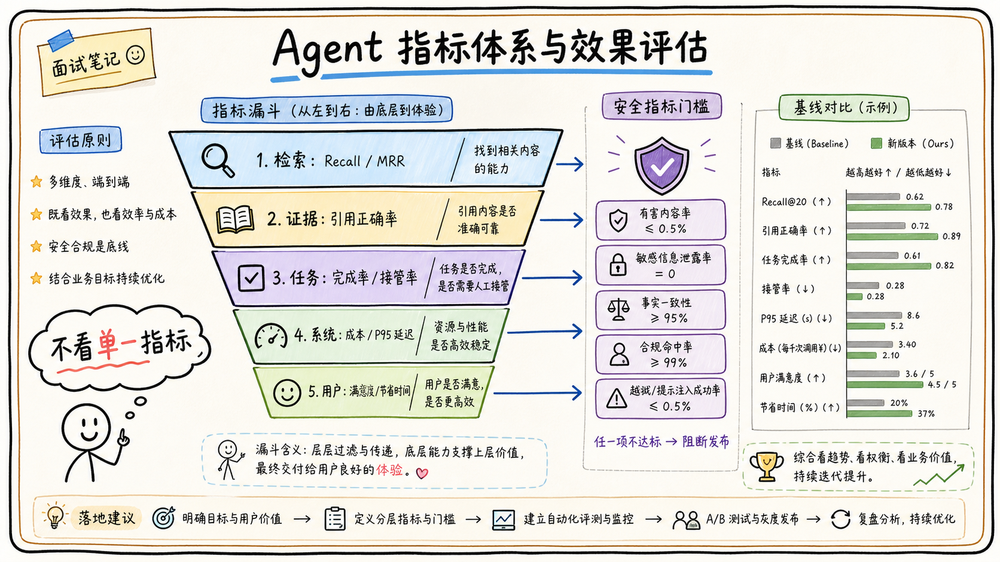

# 07-04 指标体系：准确率、引用率、成本、时延、满意度

## 面试官追问

**面试官：** 你如何衡量 Agent 项目做得好不好？

**我：** 看准确率和用户满意度。

**面试官：** 准确率怎么定义？引用率高但答案错怎么办？成本和延迟是否也算效果？

## 常见错误回答

只报一个平均准确率，或把点赞率直接当成事实正确率。

## 30 秒简答

我会建立分层指标：任务层看完成率、转人工和拒答正确率；知识层看 Recall@K、引用覆盖率、引用正确率和事实一致性；系统层看 P50/P95 延迟、Token 成本、工具成功率和错误率；用户层看满意度、重复提问率和节省时间。

指标要绑定场景和基线，例如与普通搜索或人工流程比较。不能用单一指标优化，准确率上升但延迟和成本失控，或引用率上升但引用不支持结论，都不算真正改进。

## 原理拆解

### 1. 指标定义要可复现

明确样本范围、分母、人工标注规则和统计窗口。例如引用正确率要求引用确实支持对应结论，而不是只看答案里有没有链接。

### 2. 指标要形成漏斗

检索命中是前置指标，引用正确和事实一致是质量指标，任务完成和满意度是业务结果。前面指标变好但后面不变，说明优化没有传递到用户价值。

### 3. 高风险指标要单独看

越权拦截率、敏感信息泄露率、高危动作确认率和错误写入率不能被平均指标掩盖。安全指标通常设为门槛，而不是和体验指标简单加权。

## 工程方案与取舍

离线评测看稳定质量，线上指标看真实行为，人工抽检校准自动指标。报表按租户、场景、模型和版本拆分，避免平均值掩盖长尾。

## 继续追问

**Q：满意度低但准确率高，如何解释？** 可能是延迟、表达、引用打不开或任务流程不顺，要结合行为和访谈定位。

## 面试总结

指标体系要连接“检索质量—回答质量—任务结果—用户价值—系统成本”，并对安全和高风险动作设置独立门槛。

## 深入展开：指标如何指导具体决策

### 1. 先定义业务成功事件

知识问答的成功可能是用户不再重复提问、点击引用并解决问题；审批助手的成功可能是草稿一次确认通过，而不是模型输出一段漂亮文本。指标设计先从用户任务的完成条件开始，再向前拆检索和生成指标。

### 2. 质量指标要看错误类型

准确率可以进一步拆成事实错误、条件遗漏、版本错误、引用错误和权限错误。一个答案文字正确但引用打不开，属于可用性问题；一个答案引用了无权文档，属于安全问题，不能被普通准确率平均掉。

### 3. 成本和延迟是质量约束

如果回答平均需要 10 秒和大量 Token，用户可能放弃使用；如果为了降成本只返回很短的上下文，引用完整率可能下降。因此用 P50/P95、单任务成本、平均调用轮数、缓存命中率和人工接管一起观察。

### 4. 指标要按版本和人群切分

模型升级可能只影响长问题，检索升级可能只影响某个部门，平均值会掩盖差异。报表按租户、任务类型、模型、Prompt、索引版本和风险等级切分，并保留对照组。

### 5. 指标门禁和告警

发布前设置最低引用正确率、最高无证据陈述率和安全错误率；线上设置延迟、成本、错误写入、越权拦截和人工接管告警。质量指标可以优化，安全指标通常是硬门槛。

## 6. 一次指标分析应该怎样展开

如果 Query Rewrite 上线后满意度上升，我会继续拆分问题清晰度、意图类型、租户、模型版本和索引版本，观察 Recall、引用覆盖、拒答率、重复追问、P95 和成本是否同时变化。若总体平均分提升但高风险制度问答的无证据回答增加，就不能全量发布，应先增加拒答门禁或恢复旧策略。

指标要分成领先指标和结果指标。召回覆盖、工具参数合法率和错误分类是可以提前发现问题的领先指标；任务完成、转人工、重复追问和满意度是用户结果。两类指标要在同一个 Trace 和任务 ID 上关联，才能知道检索改善是否真的减少了用户操作成本。

还要建立指标的责任动作：引用下降触发检索回归，P95 上升检查串行调用和缓存，成本上升检查上下文和模型路由，越权拦截异常触发安全排查。指标的目的不是做一张好看的报表，而是帮助团队判断继续放量、暂停、回滚还是改变方案。

## 7. 讲指标时主动说明统计口径

每个指标要有分子、分母、样本范围、时间窗口和排除规则。引用正确率不能只统计“有链接”，而要判断引用是否支持对应结论；任务完成率不能只看用户点击结束，而要观察是否真的完成源系统动作。口径稳定后，版本和人群切分才有意义。

指标冲突时先看安全和事实门槛，再在成本、速度和表达之间取舍。把指标和发布、回滚、排查动作绑定，面试官才能看到你不是只会做报表，而是能用数据推动产品迭代。

## 8. 面试中如何说明指标支持决策

先定义指标口径和样本，再按版本、人群、意图和风险切分，最后把变化关联到动作。召回和引用下降查检索，P95 上升查调用链，成本上升查上下文和重试，接管上升查失败类别，越权或敏感泄露则直接触发安全流程。

质量、速度和成本冲突时，事实正确和权限合规是硬门槛，其他指标按场景平衡。普通问答可以接受异步补充，审批和制度问答则优先可追溯。这样的指标体系能避免用一个平均满意度掩盖高风险问题。

## 面试最后补充

指标体系最终要回答三个问题：用户任务有没有完成，系统为什么成功或失败，下一版应该改哪里。把业务结果、质量、效率和安全指标关联到同一条任务 Trace，才能把数字变成决策依据。

## 一分钟示范回答

### 7. 指标体系还要服务于取舍

当质量、成本和速度不能同时最优时，要先明确不可牺牲的安全与事实门槛，再根据场景选择平衡点。普通问答可以接受稍短的引用范围，审批和制度问答则应优先完整引用与可追溯。把这种差异写进指标分层，才能避免用一个平均分掩盖高风险场景的问题。

### 6. 指标如何支持一次真实迭代

例如上线新的 Query Rewrite 后，不应该只看总体准确率。先把样本分成原问题清晰、口语化、带缩写、跨文档和无答案五组，观察每组的召回、引用覆盖、拒答率和 P95 延迟；再按新旧版本做对照。如果口语化问题提升，但无答案问题开始出现强行回答，就要增加拒答门禁，而不是直接全量发布。

满意度也要谨慎解释。点赞率受问题难度、用户预期和交互位置影响，最好同时收集“是否解决任务”“是否重复追问”“是否转人工”等行为指标。人工抽检则要明确评分标准，把事实正确、引用有效、权限合规、表达清晰分别打分。不同指标冲突时，安全和事实正确通常是硬约束，成本和表达质量再做优化。

最终要把指标和动作绑定：引用覆盖下降触发检索回归，P95 上升触发缓存或模型路由检查，越权拦截异常触发安全排查，人工接管上升触发失败意图分析。指标不是汇报装饰，而是告诉团队下一步应该查哪里、改什么以及是否允许继续放量。

“我不会只报准确率。离线看 Recall、引用覆盖和事实一致性，线上看任务完成、重复提问、接管率、P95、成本和满意度，另外把越权和错误写入设为独立安全门槛。所有指标按场景和版本切分，并与普通搜索或人工流程做基线比较，才能知道优化是否真正带来业务价值。”
