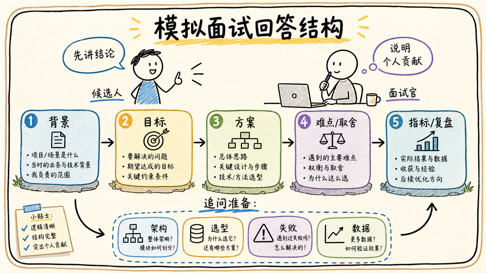

# 07-05 高频追问与完整示范回答

## 面试官追问

**面试官：** 如果让你用一分钟介绍这个 Agent 项目，你会怎么回答？

**我：** 这是一个基于大模型的飞书智能助手，可以回答问题、调用工具和自动化办公。

**面试官：** 目标用户是谁？解决什么问题？为什么这样设计？效果如何？

## 常见错误回答

从模型型号、框架和 Prompt 开始讲，最后没有说清楚业务价值和个人贡献。

## 30 秒简答

我会按“背景—目标—方案—难点—指标—复盘”回答：项目服务什么用户，解决原流程中的什么痛点；系统如何接入飞书数据、检索知识和调用工具；我负责哪一部分；最难的问题和失败案例是什么；上线后完成率、引用率、成本、时延和满意度怎样；下一步如何改进。

示范表达可以是：我们为企业员工做了一个带引用的知识问答和任务助手，重点解决制度查找慢、信息分散和重复录入问题。我负责检索链路、权限过滤和评测，先从只读场景灰度，最终通过引用和 Trace 发现并修复了旧版本召回问题。

## 原理拆解

### 1. 先讲业务，不先讲技术

用一句话说明用户、场景、痛点和结果，再补充技术实现。面试官关心的是为什么做、是否有效，以及你是否理解业务约束。

### 2. 个人贡献要具体

说清负责模块、决策、代码或产品产出、协作对象和结果指标。不要把团队所有工作都说成自己完成，也不要只说“参与了”。

### 3. 追问准备四类证据

准备架构和数据流、一个关键技术选型、一个失败复盘、一个指标变化。每类都能展开到具体样本、约束和取舍。

## 工程方案与取舍

模拟回答控制在 30 秒、2 分钟和 5 分钟三个版本；先给结论，再按面试官追问展开。遇到不知道的问题，说明已知边界、推断依据和验证方法。

## 继续追问

**Q：被问到没做过的技术怎么办？** 不冒充经验，可以说明类似问题的设计思路和会如何验证。

## 面试总结

好的项目回答不是背架构，而是用业务目标、个人贡献、技术取舍、数据证据和失败复盘证明你能把系统做成。

## 深入展开：五类高频追问的答题结构

### 1. 被问“为什么用 Agent”

先说明任务的不确定性和实时观察需求，再说明哪些边界仍由 Workflow 控制。不要把 Agent 说成更强的模型，而要说明它如何根据检索或工具结果改变下一步。

### 2. 被问“为什么不用普通 RAG”

说明问题是否需要多轮检索、表格实时查询、任务状态、确认和工具执行。如果只是一次文档问答，普通 RAG 可能更简单；只有当用户目标需要动态路由时，Agent 才有额外收益。

### 3. 被问“模型错了怎么办”

按检索、权限、工具、生成和产品体验分类，说明如何通过引用约束、拒答、Schema、人工确认、Trace 和回归集降低风险。不要只回答“换更大的模型”。

### 4. 被问“你做了什么”

用动作和结果回答：我定义了什么接口、改了什么策略、定位了什么失败、上线后哪个指标变化。若是团队工作，清楚区分自己负责的模块和协作部分。

### 5. 被问“如果重做会怎么改”

从现有数据和失败案例出发，提出一个可验证的改进，而不是泛泛说“加强测试”。例如增加权限快照、把表格查询从 RAG 中拆出来、缩短 Agent Loop 或提前加入高风险确认。

## 6. 三十秒、两分钟和五分钟答题节奏

三十秒只讲目标、用户、核心方案和结果；两分钟补架构边界、关键取舍、一个失败案例和指标；五分钟再展开具体接口、数据模型、权限、重试或评测。面试官打断时要能随时收束，不要把所有细节一次性倾倒。每个技术名词后面都准备一句“为什么需要”和一句“出问题怎么办”。

遇到“为什么用 Agent”“为什么不用普通 RAG”这类追问，可以回到任务不确定性和控制边界：动态检索或多步规划有价值，但审批、权限、写入和通知仍由规则或 Workflow 控制。遇到“模型错了怎么办”，回答证据、拒答、Trace、人工接管和回归集；遇到“你做了什么”，回答具体模块、决策、协作和指标。

没有真实数据时要明确是估算或设计目标，不要编造精确百分比；不知道某个 API 细节时，可以说自己会先查官方文档并用最小样例验证，再说明接口设计原则。坦诚边界、给出验证方法，同样是工程能力的一部分。

## 7. 讲项目时保持前后一致

项目名称、用户、数据源、个人贡献、指标和失败案例要互相对应。前面说系统是只读问答，后面就不要突然声称自动完成审批；前面说没有真实线上数据，后面就不要给出精确线上提升百分比。遇到追问时，优先引用已经讲过的架构和证据，避免为了显得厉害临时扩展不真实的能力。

一个可信的项目回答通常会留下一个限制和一个下一步计划，例如权限数据还需要更高频同步、表格口径还需要语义层治理、写操作仍需人工确认。面试官更关心你是否知道系统哪里不可靠，以及你会怎样验证和改进。

## 8. 面试中如何保持回答可信

把项目事实、估算、设计目标和个人判断分开说。真实指标说明口径，估算说明假设，设计目标说明上线门槛；不确定的 API 细节就说明验证办法。回答始终围绕目标、边界、证据、取舍和复盘，不为了覆盖追问而凭空增加系统能力。

最后准备三个可展开案例：一次检索或引用问题、一次工具或权限问题、一次上线或评测问题。每个案例都能讲清现象、定位、动作和结果，面试官无论从产品、工程还是安全角度追问，都能回到同一套项目事实。

## 完整示范回答

“这个项目服务企业员工，主要解决制度和项目资料分散、查找慢以及重复录入的问题。我负责知识接入、混合检索、ACL 过滤和评测。系统把飞书文档、知识库和表格分开接入，检索时先做权限过滤，模型只看真实证据；涉及任务创建时生成草稿，用户确认后才调用写工具。最难的是旧版本和父块扩展导致的引用错误，我们通过 Trace 定位并补了版本继承和回归集。上线后同时观察引用正确率、任务完成率、P95 和人工接管，而不是只看点赞。”

## 面试总结升级版

### 6. 让示范回答更像真实项目

完整回答可以使用三层结构。第一层用三十秒讲目标、用户和结果；第二层用两分钟讲架构、关键边界和一个失败案例；第三层根据面试官兴趣展开某个技术点，例如 ACL、Chunk 版本、工具幂等或评测集。这样既不会一开始陷入细节，也能在追问时证明自己真正理解实现。

回答数字时要区分真实数据、估算数据和设计目标。真实数据说明统计口径和时间范围；估算数据说明假设，例如日活、平均问题数和模型调用轮数；设计目标则说明上线前希望达到什么标准。没有把握时可以直接说“这里我不记得精确值，但当时主要观察这三个指标”，然后继续讲验证方法，比编一个精确百分比更可靠。

最后要把技术选择和业务结果连起来。不是因为用了 Agent、RAG 或 MCP 所以项目先进，而是因为它减少了查找时间、降低了重复录入、提高了引用可信度或让高风险操作可审计。面试官问任何概念，都可以回到目标、边界、证据、取舍和复盘这五个关键词。

回答任何项目问题，都可以回到五个词：目标、边界、证据、取舍、复盘。先说结果，再解释系统如何保证结果可信，最后说明下一步如何验证。
