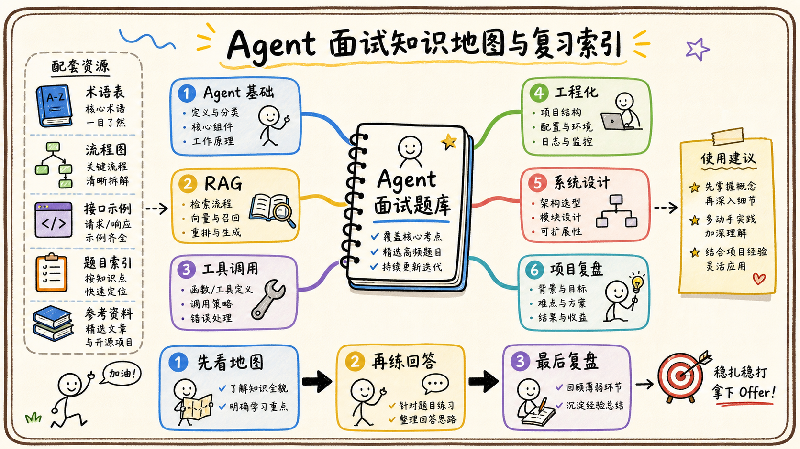

# 08-附录：术语表、流程图、接口示例、题目索引、参考资料

## 适用方式

这份附录用于面试前快速复习和项目答题时查找关键词。不要把术语表当成孤立背诵材料，应该能把每个词放回“数据—模型—工具—权限—评测”的完整链路中。



## 术语表

| 术语 | 一句话理解 |
| --- | --- |
| LLM | 根据上下文理解和生成内容的概率模型。 |
| Agent | 围绕目标使用模型、工具、状态和控制循环执行任务的系统。 |
| Workflow | 由代码或规则确定步骤和分支的编排流程。 |
| RAG | 先检索外部证据，再让模型基于证据生成答案。 |
| Chunk | 用于检索和引用的内容片段。 |
| Embedding | 将文本映射到向量空间的表示。 |
| Rerank | 对候选检索结果重新排序。 |
| Function Calling | 模型输出结构化工具调用意图的机制。 |
| MCP | 连接模型客户端与工具、资源、上下文服务的标准协议。 |
| ACL | 资源级访问控制列表。 |
| Trace | 串联一次任务各阶段调用的可观测链路。 |

## 高频流程图

```text
用户目标 -> 意图识别 -> 权限判断 -> 检索/工具调用
-> 观察结果 -> 更新状态 -> 生成草稿或继续执行
-> 风险确认 -> 最终回复/写入 -> 审计与回放
```

## 接口示例

工具 Schema 应明确用途、参数和风险边界：

```json
{
  "name": "search_feishu_docs",
  "description": "搜索当前用户有权限访问的飞书文档",
  "parameters": {
    "type": "object",
    "required": ["query"],
    "properties": {
      "query": {"type": "string", "maxLength": 200},
      "limit": {"type": "integer", "minimum": 1, "maximum": 20}
    }
  }
}
```

工具返回值建议包含 `success`、`error_code`、`retryable`、`request_id`、`data` 和 `source`，不要把内部异常和密钥直接回传模型。

## 题目索引

- Agent 基础：控制权、Agent Loop、规划、记忆、单 Agent 与多 Agent。
- 飞书场景：知识问答、会议纪要、审批、表格分析、IM 自动化、员工助手。
- RAG：接入、切分、召回、引用、同步、ACL、评测。
- 工具调用：Function Calling、MCP、开放 API、幂等、确认和卡片。
- 工程化：多租户、权限、安全、成本、可观测、灰度。
- 系统设计：知识问答、审批、跨源分析、多 Agent、生产化。

## 参考资料使用原则

优先阅读飞书开放平台官方 API 文档、模型提供方官方文档和项目实际 Trace。面试中引用资料不是为了堆链接，而是说明你如何验证接口、权限、限制和失败行为。

## 面试总结

复习时先用题目索引定位主题，再用流程图复述链路，最后用接口示例检查参数、权限、幂等和错误处理是否完整。

## 进阶复习方法

### 1. 从一个真实任务串起全部术语

可以用“员工询问制度并创建待办”作为贯穿案例：LLM 负责理解问题，Agent 负责规划，RAG 负责检索证据，Embedding 和 Rerank 负责召回排序，Function Calling 负责表达工具意图，飞书 API 负责执行，ACL 负责过滤，Workflow 负责确认和通知，Trace 负责回放。这样复习时不会把术语记成互相孤立的名词。

### 2. 看到一个组件要追问五件事

它的输入是什么，输出是什么，谁拥有控制权，失败时怎么办，如何评测？例如看到“向量库”，要继续问 Chunk 从哪里来、权限怎么过滤、删除如何同步、查询慢怎么办、命中是否真的提高答案质量。看到“工具”，要继续问 Schema、授权、幂等、超时和人工确认。

### 3. 看到一个流程图要补三条边

第一条是权限边：哪些数据可以进入下一步；第二条是失败边：超时、拒绝、无答案和部分成功如何处理；第三条是观测边：如何知道发生了什么。面试系统设计时，能补出这三条边，回答就会比只画成功主链路完整很多。

### 4. 代码和接口示例的阅读重点

先看认证方式和 scope，再看参数 Schema、分页、版本和错误码；写操作继续看幂等键、状态查询和回调；事件接口继续看验签、去重、顺序和重试。不要只记住接口路径，要知道它的限制和失败行为。

### 5. 最后做一轮模拟面试

每个主题准备 30 秒简答、2 分钟展开和 5 分钟系统设计三种版本。30 秒讲边界和结论，2 分钟讲原理、场景和取舍，5 分钟补数据流、权限、指标和失败恢复。回答卡住时回到“目标—数据—模型—工具—权限—评测”六个关键词。

## 面试前一天的使用方法

第一遍不要从术语表背定义，而是选一个完整场景，例如“员工询问制度并创建待办”，沿着入口、身份、检索、ACL、模型、工具、确认和审计走一遍。遇到每个组件都问自己：它接收什么输入、输出什么状态、谁拥有决策权、失败如何恢复、怎样证明结果可靠。这样术语会和系统链路绑定，面试时更容易讲出因果关系。

第二遍只看流程图和接口示例，把每条箭头补成一句话：调用前做什么校验，调用后如何处理结果，超时和重复请求怎么办。第三遍使用题目索引随机抽题，先用三十秒给结论，再用两分钟讲工程细节，最后补一个取舍或失败案例。答不出的题不要只标记“不会”，而要记录缺少的是概念、边界、实现还是指标。

## 复习材料的取舍原则

术语表用于快速定位概念，流程图用于练习因果关系，接口示例用于追问参数和错误，题目索引用于模拟压力。复习时不需要把所有内容背成定义，而要能够从一个业务目标说出入口、数据、决策、工具、权限、失败和指标。遇到新组件，也用同一套问题判断它在系统中承担什么责任。

参考资料要优先看官方接口、协议和安全说明，再看案例和博客。面试回答可以借鉴行业通用原则，但不要把没有亲自验证的实现说成项目事实。最后把错题和追问写回对应章节，下一次复习直接从失败点开始，效率比从头阅读更高。

## 最后检查自己的回答

每道题至少准备三层答案：先说结论和边界，再说链路和工程细节，最后说指标、失败和取舍。看到 Agent、RAG、MCP 或飞书 API 等词时，不要停在定义，要继续说明谁做决策、谁执行、数据从哪里来、权限如何控制以及出错后如何恢复。这样整套题会形成统一的表达框架。

复习时还要定期回看错题，确认自己能把概念迁移到新的企业场景，而不是只记住原题答案。每次模拟都记录薄弱点。

## 速查清单

- Agent：谁决定下一步？什么时候停止？
- RAG：证据从哪里来？版本和 ACL 如何保证？
- 工具：参数谁校验？写操作怎样幂等和确认？
- 工程化：多租户、审计、成本、延迟和回滚在哪里？
- 系统设计：主链路、失败链路和指标是否完整？
- 项目回答：个人贡献、数据证据和失败复盘是否具体？
